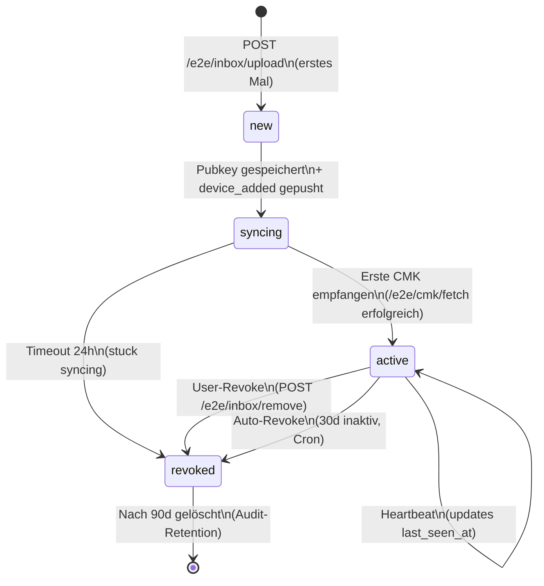
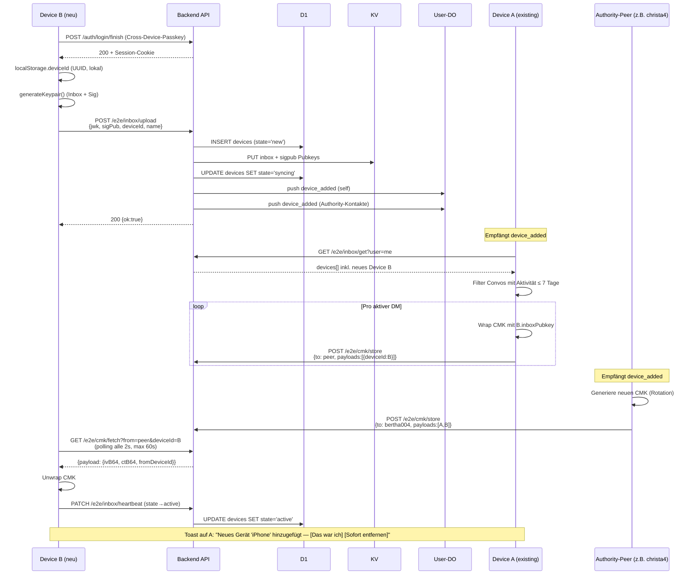
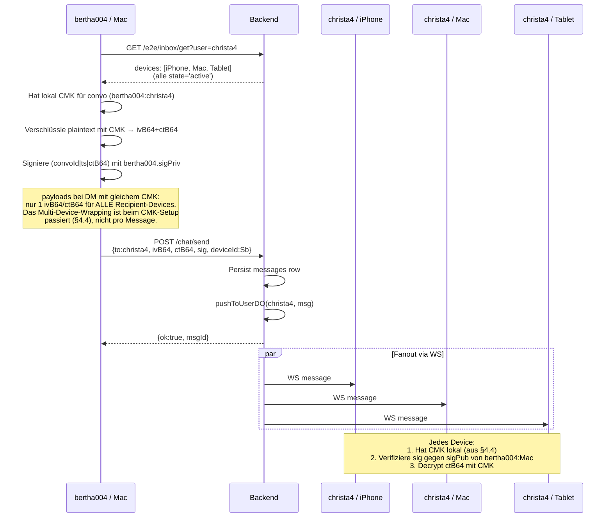
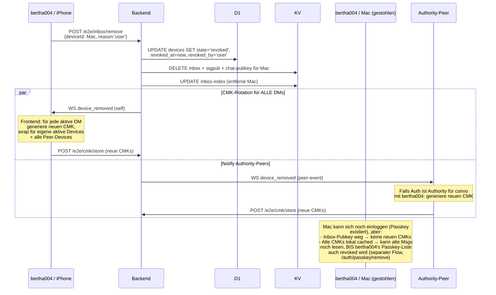
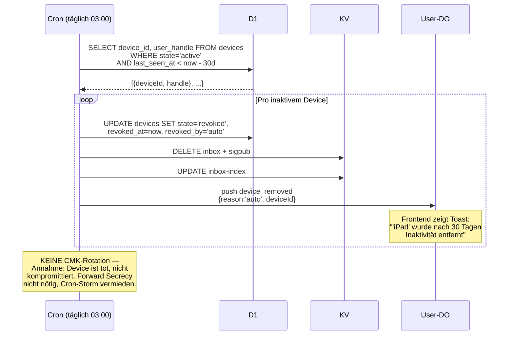
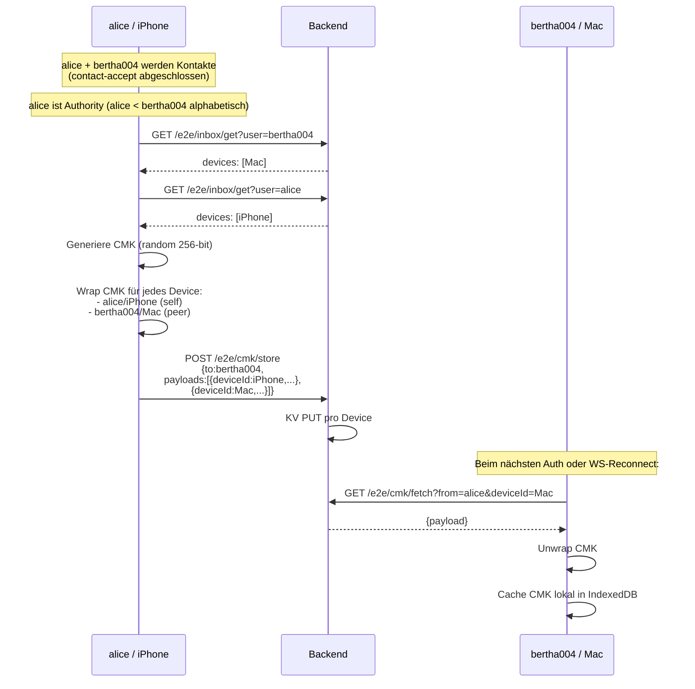
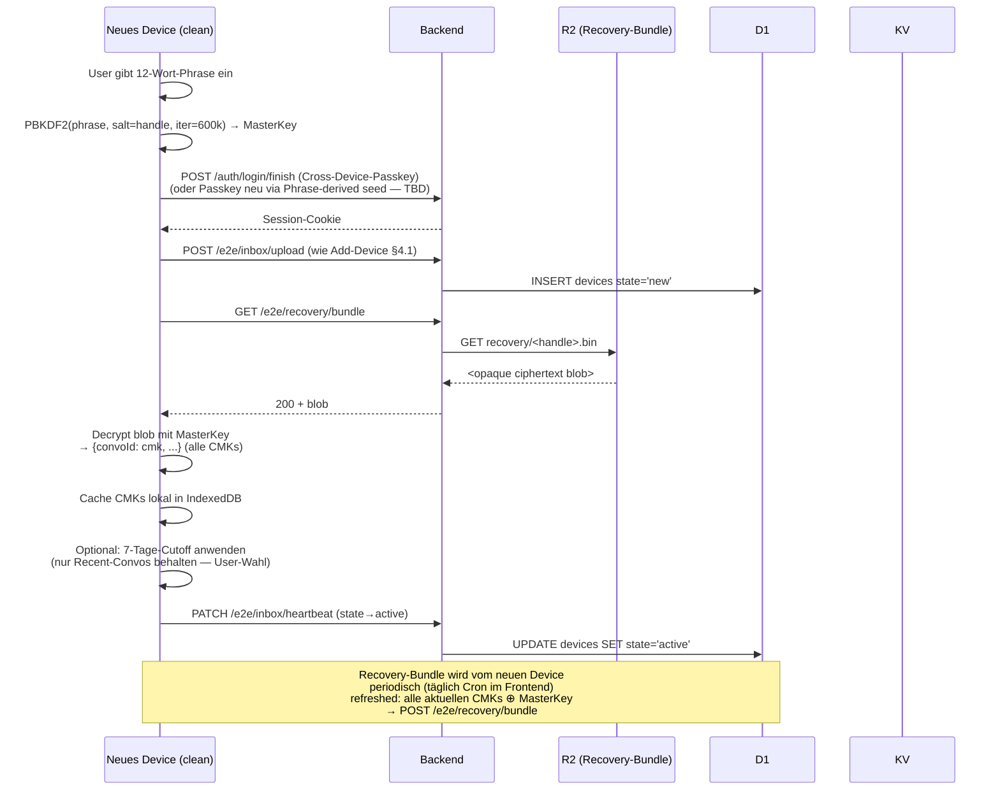

# RENEX — Multi-Device Spec

> **Phase 1B / 1C Architecture**
> Verbindliche Spec für die Multi-Device-Implementierung mit aktuellem CMK-System.
> Signal-Protocol-Migration siehe Phase 8 (separate Spec).

**Status:** Draft v1
**Version:** 1.0
**Letzte Aktualisierung:** 2026-04-28
**Autor:** Bruno Hochstrasser
**Verbindlich ab:** Phase 1B (Juni 2026)

---

## Inhaltsverzeichnis

1. [Glossar](#1-glossar)
2. [Datenmodell](#2-datenmodell)
3. [Device-State-Machine](#3-device-state-machine)
4. [Sequence-Diagrams](#4-sequence-diagrams)
   - 4.1 [Add-Device](#41-add-device-flow)
   - 4.2 [Send (Multi-Device)](#42-send-flow-multi-device)
   - 4.3 [Revoke (User + Auto)](#43-revoke-flow)
   - 4.4 [CMK-Distribution](#44-cmk-distribution-flow)
   - 4.5 [Recovery via BIP39](#45-recovery-via-bip39-flow)
5. [Edge-Cases](#5-edge-cases)
6. [Limits & Rate-Limits](#6-limits--rate-limits)
7. [Migration-Pfad](#7-migration-pfad)
8. [Test-Matrix](#8-test-matrix)
9. [Decision Log](#9-decision-log)
10. [API-Surface](#10-api-surface)
11. [Pro-Tier-Voraussetzung](#11-pro-tier-voraussetzung)
12. [Settings-UI-Spec](#12-settings-ui-spec)
13. [Offene Items](#13-offene-items)

---

## 1. Glossar

| Begriff | Bedeutung |
|---|---|
| **Device** | Konkreter Browser-Install eines Users. Eindeutig durch `deviceId` (UUID, clientseitig generiert, in localStorage). |
| **Inbox-Key** | RSA/ECDH-Pubkey eines Devices, mit dem CMKs gewrappt werden. Pro Device einer. |
| **Sig-Pub** | ECDSA-P256-Pubkey eines Devices für Message-Signaturen. Pro Device einer. |
| **CMK** | Conversation Master Key — symmetrischer Schlüssel pro DM-Konversation. |
| **GSK** | Group Sender Key — symmetrischer Schlüssel pro User pro Gruppe (Sender-Keys-Pattern). |
| **Authority** | Der User in einer DM-Konversation, dessen Handle alphabetisch kleiner ist. Verantwortlich für CMK-Generierung + Distribution bei Membership-Änderungen. |
| **Device-State** | `new` → `syncing` → `active` → `revoked` (siehe §3). |
| **Recovery-Cutoff** | 7 Tage. CMKs/GSKs für Konversationen ohne Aktivität in den letzten 7 Tagen werden NICHT an neue Devices verteilt. |
| **Recovery-Phrase** | BIP39 12-Wort-Phrase. Nur für Account-Recovery (alle Devices verloren), nicht für Add-Device im Normalfall. |

---

## 2. Datenmodell

### 2.1 D1 — Source-of-Truth (neue Tabelle)

```sql
CREATE TABLE devices (
  device_id    TEXT    PRIMARY KEY,
  user_handle  TEXT    NOT NULL,
  state        TEXT    NOT NULL DEFAULT 'new',  -- new|syncing|active|revoked
  name         TEXT,                             -- z.B. "Mac (Safari)"
  user_agent   TEXT,                             -- raw UA (debugging)
  created_at   INTEGER NOT NULL,
  last_seen_at INTEGER NOT NULL,
  revoked_at   INTEGER,
  revoked_by   TEXT                              -- user|auto|self
);

CREATE INDEX idx_devices_user_state
  ON devices(user_handle, state);

CREATE INDEX idx_devices_lastseen_active
  ON devices(last_seen_at)
  WHERE state = 'active';
```

### 2.2 KV — Hot-Cache für Send-Path (bestehend, leicht angepasst)

| Key | Wert | TTL | Owner-Tabelle |
|---|---|---|---|
| `e2e:inbox:<handle>:<deviceId>` | JWK (Inbox-Pubkey) | — | `devices` |
| `e2e:inbox:sigpub:<handle>:<deviceId>` | JWK (Sig-Pubkey) | — | `devices` |
| `e2e:inbox:index:<handle>` | `[deviceId, ...]` | — | abgeleitet aus `devices WHERE state IN ('active','syncing')` |
| `chat:pubkey:<handle>:<deviceId>` | JWK (legacy DM-Pubkey, deprecated) | — | `devices` |
| `e2e:cmk:<convoId>:<deviceId>` | `{ fromDeviceId, ivB64, ctB64 }` | — | — (CMK-Wrap für Recipient-Device) |
| `e2e:cmk:index:<convoId>` | `[deviceId, ...]` | — | — |
| `e2e:cmk:user-idx:<handle>` | `[convoId, ...]` | — | für Account-Delete-Cleanup |
| `e2e:gsk:<groupId>:<handle>:<deviceId>` | `{ fromDeviceId, ivB64, ctB64 }` | — | — |
| `e2e:gsk:index:<groupId>:<handle>` | `[deviceId, ...]` | — | — |

**Regel:** D1 ist Source-of-Truth für *Existenz/State*. KV ist Cache für *Crypto-Material*. Bei Konflikt gewinnt D1 (Send-Path filtert KV-Devices gegen `state='active'`).

### 2.3 Bestehende Tabellen — relevante Felder

- `messages.payloads` — JSON-Array `[{deviceId, ivB64, ctB64}, ...]` für Multi-Device-Encryption
- `messages.device_id` — Sender-Device-ID (für Sig-Verifikation)
- `messages.sig` — ECDSA-Signatur über `(convoId|ts|ctB64)` mit Sender-Sig-Privkey

---

## 3. Device-State-Machine



### 3.1 Transitions-Tabelle

| From | To | Trigger | Side-Effects | `revoked_by` |
|---|---|---|---|---|
| `[*]` | `new` | `POST /e2e/inbox/upload` (Device unbekannt) | INSERT `devices` row, KV-Write Pubkey | — |
| `new` | `syncing` | Same Request, nach KV-Write | `device_added` Event an Self-DO + Authority-Kontakte | — |
| `syncing` | `active` | Erste erfolgreiche CMK-Fetch oder erste Message-Send | UPDATE `state='active'`, `last_seen_at=now()` | — |
| `syncing` | `revoked` | Cron erkennt Device > 24h in `syncing` | UPDATE `state='revoked'`, KV-Cleanup | `auto` |
| `active` | `active` | Auth-Request mit Device-Cookie | UPDATE `last_seen_at=now()` (debounced 1×/h) | — |
| `active` | `revoked` | `POST /e2e/inbox/remove` von User-Session | KV-Cleanup, `device_removed` Event, **CMK-Rotation** | `user` (oder `self`) |
| `active` | `revoked` | Cron: `last_seen_at < now - 30d` | KV-Cleanup, `device_removed` Event, **KEINE Rotation** | `auto` |
| `revoked` | gelöscht | Cron: `revoked_at < now - 90d` | DELETE row | — |

### 3.2 `revoked_by`-Semantik (kritisch für Forward Secrecy)

| Wert | Bedeutung | CMK-Rotation? |
|---|---|---|
| `user` | User klickt "Gerät entfernen" in fremder Session (Sicherheits-Aktion: gestohlen, verkauft) | **JA** — Forward Secrecy nötig |
| `self` | Device entfernt sich selbst (Logout mit Cleanup) | **NEIN** — Device ist nicht kompromittiert |
| `auto` | 30d Inaktivität-Cleanup | **NEIN** — Annahme: Device ist tot, nicht kompromittiert |

---

## 4. Sequence-Diagrams

### 4.1 Add-Device-Flow

User hat schon Device A (Mac) aktiv. Loggt sich auf Device B (iPhone) ein.



**Wichtig:** Cross-Device-Passkey (Schritt 1) ist Voraussetzung — der User authentifiziert sich gegenüber seinem bestehenden Account via WebAuthn-Bluetooth/QR. Es gibt **keine** zusätzliche Add-Device-Bestätigung; der Passkey IST die Bestätigung. Toast auf existierendem Device dient nur als Rückmeldung + Notbremse.

### 4.2 Send-Flow (Multi-Device)

bertha004 (1 Device: Mac) sendet an christa4 (3 Devices: iPhone, Mac, Tablet).



**Schlüssel-Insight:** CMK ist *symmetrisch und shared* zwischen allen Convo-Devices. Daher braucht der Sender beim Send NUR einen Ciphertext, nicht N. Die N-Verschlüsselung passiert nur beim **CMK-Setup** (§4.4) und bei **Membership-Änderungen** (§4.1, §4.3).

→ Send-Kosten skalieren in O(1), nicht O(N×M). Das ist der Grund, warum CMK über Per-Message-Encryption gewählt wurde.

### 4.3 Revoke-Flow

#### 4.3.1 User-Revoke (Sicherheits-Aktion)

bertha004 entfernt Mac (gestohlen) von iPhone aus.



**Wichtig:** Device-Revoke entfernt nur Crypto-Material. Der **Passkey** muss separat über `/auth/passkey/remove` revoked werden — sonst kann das gestohlene Device sich noch einloggen (auch wenn es nichts mehr empfangen kann). UI-seitig wird das als kombinierter Flow dargestellt: "Gerät entfernen" → revoked Device + Passkey gemeinsam.

#### 4.3.2 Auto-Revoke (Cron, 30d Inaktivität)



### 4.4 CMK-Distribution-Flow

Drei verschiedene Auslöser für CMK-Distribution:

#### 4.4.1 Erst-Kontakt (DM-Initialisierung)



#### 4.4.2 Add-Device (siehe §4.1)

#### 4.4.3 Rotation bei User-Revoke (siehe §4.3.1)

### 4.5 Recovery via BIP39 (Flow)

**Anwendungsfall:** Alle aktiven Devices verloren (Phone gestohlen + Backup-Mac kaputt). User hat nur die 12-Wort-Phrase aus dem ersten Onboarding.



#### 4.5.1 Bundle-Update (Write-Path)

Jedes aktive Device des Users führt täglich (oder bei jeder CMK-Rotation) folgenden Schritt aus:

```js
// Frontend, im Service-Worker oder Background-Sync
async function refreshRecoveryBundle() {
  const allCMKs = await indexedDB.getAllCMKs();
  // { "alice:bob": cmkBytes, "alice:charlie": cmkBytes, ... }
  const blob = await encrypt(JSON.stringify(allCMKs), masterKey);
  await fetch('/e2e/recovery/bundle', {
    method: 'POST',
    body: blob,
    headers: {'Content-Type': 'application/octet-stream'}
  });
}
```

Server-Side: `R2.put(recovery/<handle>.bin, blob)`. Server kann nicht entschlüsseln. Race-Condition (zwei Devices schreiben gleichzeitig) ist unkritisch — letzter gewinnt, beide Bundles sind gleich.

#### 4.5.2 Forward-Secrecy-Tradeoff (bewusst)

BIP39-Recovery durchbricht Forward Secrecy: gestohlene Phrase + R2-Read-Zugriff = alle CMKs lesbar. **Akzeptabel**, weil:
1. Phrase ist physisch (Papier) → Threat-Modell ist anders als bei kompromittiertem Device.
2. R2-Read erfordert Auth (Cookie / Passkey-Session) → Angreifer braucht beides: Phrase + Account-Zugang.
3. Phrase-Verlust = User-Verantwortung, klar kommuniziert beim Onboarding.

Alternative ("FS-strict": kein R2-Backup, Recovery löscht alle alten Convos) wurde verworfen — UX-Schmerz zu hoch für Beta-Launch. Ggf. als Pro-Feature in Phase 8 bei Signal-Migration neu evaluieren.

**Recovery-Cutoff-Regel:** Beim Add-Device verteilt das *existierende* Device (A in §4.1) CMKs nur für DMs mit Aktivität in den letzten 7 Tagen. Konkret:

```js
// Pseudo-Code im Frontend
const ACTIVE_CUTOFF = 7 * 86400_000;
const cutoffTs = Date.now() - ACTIVE_CUTOFF;
const recentConvos = await db.messages
  .where('ts').above(cutoffTs)
  .uniqueValues('convoId');
for (const convoId of recentConvos) {
  await wrapAndStoreCMK(convoId, newDeviceId);
}
// Ältere Convos: User sieht Empty-State auf neuem Device.
// Recovery via BIP39 (separater Flow) erlaubt vollen Restore.
```

---

## 5. Edge-Cases

| # | Szenario | Verhalten |
|---|---|---|
| 1 | Send während device_added in flight (race) | Sender encryptet mit aktuellem CMK. Neues Device hat noch keinen CMK → polled `/e2e/cmk/fetch`, fetched, kann Nachricht via lokaler IndexedDB-Replay lesen (Sender re-pusht NICHT). |
| 2 | Authority offline beim Add-Device | Existierende Devices verteilen CMK nicht → neues Device stuck `syncing`. Cron räumt nach 24h auf. **Workaround**: Authority-Online-Check beim Add-Device-UI; wenn offline, Hinweis "Bitte aktiviere ein anderes Gerät, um den Sync abzuschließen." |
| 3 | Authority löscht Account | Beim Account-Delete wird das User-DO Authority-Bit umverteilt: nächst-kleinster Handle pro Convo wird neue Authority. CMK bleibt unverändert (nur Verantwortlichkeit für *zukünftige* Rotationen wechselt). Kein Re-Wrap nötig. |
| 4 | 6. Device bei 5er-Limit (Free) | API antwortet `409 device_limit_reached` mit `{currentDevices: [...], maxDevices: 5}`. Frontend zeigt Modal: "Du hast 5/5 Geräte. Wähle eines zum Entfernen oder upgrade auf Pro (10 Geräte)." Kein Auto-Eviction. |
| 5 | 11. Device bei 10er-Limit (Pro) | Wie #4, aber ohne Pro-Upgrade-Option. |
| 6 | Race: zwei Devices revoken gleichzeitig | D1 `UPDATE` ist atomar. Zweiter Request bekommt `404 device_not_found` zurück → Frontend zeigt "Gerät bereits entfernt", refreshed Liste. |
| 7 | Pubkey upgeloadet, Frontend crasht vor `device_added`-Event | D1 hat `state='new'`. Cron räumt nach 24h `state='new'` weg (separater Cleanup). Beim nächsten Login: Frontend erkennt fehlenden CMK-Zustand, triggert erneut `/e2e/inbox/upload` (idempotent: gleicher deviceId überschreibt KV). |
| 8 | Group-Member fügt Device hinzu | Beim `device_added` (self) muss Frontend für JEDE Gruppe, in der User Mitglied ist, den eigenen GSK für das neue Device wrappen + via `/e2e/group-gsk/store` ablegen. Bestehender Code [`e2eRoutes.js:443`](app.renex/src/routes/e2eRoutes.js:443) unterstützt das bereits — der Flow muss nur frontendseitig getriggert werden. |
| 9 | Recovery via BIP39 nach komplettem Device-Verlust | Siehe §4.5 — neues Device fetcht `recovery/<handle>.bin` aus R2, decryptet mit Phrase-derived MasterKey, hat alle CMKs. Forward-Secrecy-Tradeoff bewusst akzeptiert (§4.5.2). |
| 10 | Device wird revoked, kommt nach 31d zurück | `state='revoked'` ist endgültig. Device muss neuen `deviceId` generieren (localStorage clear oder Phrase-basierter Re-Add) → durchläuft `[*] → new → syncing → active`. Alte CMKs werden nicht wiederhergestellt. |
| 11 | Auto-Revoke trifft last-active-Device eines Users | Nicht gesondert behandelt — User hat keinen Zugriff mehr und muss via BIP39 recovern. UI-Warnung: "Du hast 1 aktives Gerät. Wenn du es 30 Tage nicht nutzt, wird es entfernt." |

---

## 6. Limits & Rate-Limits

| Limit | Wert | Wo geprüft | Begründung |
|---|---|---|---|
| Max Devices (Free) | 5 | `POST /e2e/inbox/upload` | VISION §5 |
| Max Devices (Pro) | 10 | `POST /e2e/inbox/upload` | VISION §8 |
| Auto-Revoke nach Inaktivität | 30 Tage | Cron daily 03:00 | VISION §5 |
| Stuck-Syncing-Cleanup | 24h | Cron daily 03:00 | Edge-Case #7 |
| Revoked-Row-Retention | 90 Tage | Cron daily 03:00 | Audit-Forensik |
| Recovery-Cutoff (CMK-Share) | 7 Tage | Frontend (Add-Device-Flow) | VISION §6, iMessage-Standard |
| `/e2e/inbox/upload` | 5/min/User | Existing rate-limit | Anti-Spam |
| `/e2e/inbox/remove` | 10/min/User | Neu | Anti-Mass-Revoke-DoS |
| `/e2e/inbox/get` | 30/min/User | [`e2eRoutes.js:234`](app.renex/src/routes/e2eRoutes.js:234) | Bereits vorhanden |
| `/e2e/inbox/heartbeat` | 4/min/User (effektiv 1/h via Debounce) | Neu | last_seen-Tracking |
| `/e2e/devices/list` | 30/min/User | Neu | Settings-UI |
| `/e2e/cmk/store` | 60/min/User | Neu (heute ungelimitet!) | CMK-Spam verhindern |
| `/e2e/cmk/fetch` | 30/min/User | [`e2eRoutes.js:415`](app.renex/src/routes/e2eRoutes.js:415) | Bereits vorhanden |
| `/e2e/recovery/bundle` GET | 5/min/User | Neu | Recovery ist seltener Flow |
| `/e2e/recovery/bundle` POST | 6/h/User | Neu | Backup-Refresh täglich reicht |
| Device-Name-Länge | 64 Zeichen | `POST /e2e/inbox/upload` | UX |
| Device-ID-Länge | 8–64 Zeichen | bestehend | bestehend |
| Heartbeat-Debounce | 1×/Stunde | Backend | Schreib-Last D1 |

---

## 7. Migration-Pfad

### 7.1 Phase 1B.1 — Schema-Migration (Tag 1)

**1. Schema-File:** `app.renex/schema-devices.sql` mit Tabelle + 3 Indizes (siehe §2.1).
Deploy: `npx wrangler d1 execute renex-db --file=schema-devices.sql`

**2. Backfill-Script:** `scripts/backfill-devices.js` (one-shot Worker-Endpoint, NICHT in Production-Routes).
Liest alle `e2e:inbox:index:*` aus KV → für jeden enthaltenen `deviceId`:
```sql
INSERT OR IGNORE INTO devices
  (device_id, user_handle, state, created_at, last_seen_at)
VALUES (?, ?, 'active', now(), now());
```
Idempotent. Bestehende Devices erhalten `state='active'` (nicht `'syncing'`), weil sie vor der Migration schon arbeiten.

**3. Verifikation:** `SELECT COUNT(*) FROM devices` muss `>= COUNT(distinct deviceId in alle inbox-index KV-Werte)` ergeben.

### 7.2 Phase 1B.2 — Code-Änderungen Backend (Tag 1–2)

Siehe separate Sektion "Code-Skizze" (folgt nach dieser Spec).

### 7.3 Phase 1B.3 — Frontend-UI (Tag 3–5)

- Settings-Page: `/settings/devices` — Liste aller Devices mit Name, last_seen, State, Revoke-Button
- Add-Device-Flow: bestehender Cross-Device-Passkey-Login — keine UI-Änderung
- Toast-Notifications für `device_added` / `device_removed` Events
- Onboarding: 7-Tage-Cutoff-Erklärung beim ersten Add-Device

### 7.4 Phase 1B.4 — Cron-Erweiterung (Tag 6)

`src/cron.js` erhält:
- Auto-Revoke-Sweep (30d)
- Stuck-Syncing-Cleanup (24h)
- Revoked-Row-Retention (90d)

### 7.5 Phase 1C — Group-Multi-Device (Woche 7)

- Frontend: `device_added` (self) triggert GSK-Re-Wrap für alle Gruppen
- Test: 5×5-Konfiguration (5 Members × 5 Devices) — siehe §8

### 7.6 Backward-Compat

- Bestehende Devices in KV ohne D1-Row: Backfill-Script läuft 1× beim Deploy. Danach: jede `/e2e/inbox/upload` wird auch in D1 geschrieben.
- Legacy `chat:pubkey:<handle>` (single-key, ohne deviceId): bleibt für Read-Path bis Phase 1B.5, dann entfernt. Siehe [`e2eRoutes.js:97-104`](app.renex/src/routes/e2eRoutes.js:97).

---

## 8. Test-Matrix

### 8.1 Vitest Unit-Tests (Phase 1A.5)

| Test | Datei | Was wird getestet |
|---|---|---|
| `wrapCMKForDevice` | `tests/crypto.test.js` | CMK-Wrap mit Pubkey ergibt Unwrap-baren Ciphertext |
| `recoveryCutoffFilter` | `tests/multidevice.test.js` | 7-Tage-Filter wählt nur recent Convos |
| `deviceStateTransitions` | `tests/multidevice.test.js` | Erlaubte/verbotene Transitions |

### 8.2 Integration-Tests (manuell, Phase 1B)

| Szenario | Steps | Expected |
|---|---|---|
| Happy-Path Add | Device A registriert, B fügt sich hinzu, beide senden 1 Msg | Beide sehen beide Msgs |
| Revoke + Rotation | A entfernt B, A sendet | Sender hat neuen CMK, B (revoked) kann nicht mehr decrypten |
| Auto-Revoke | Device manipuliert `last_seen_at = now-31d`, Cron triggern | Device `state='revoked'`, KEIN device_removed-Push an Peers |
| Authority-Switch | Authority löscht Account | Verbleibende Convo-Member: Authority-Rolle wechselt zu nächst-kleinerem Handle |
| 5×5 Group | 5 Members × 5 Devices, 1 Msg in Group | 25 Recipients sehen Msg |
| Recovery-Cutoff | DM mit letzter Msg vor 8 Tagen, Add-Device | Neues Device sieht Convo nicht (oder Empty-State) |
| Stolen-Phone | User-Revoke + Passkey-Remove parallel | Gestohlenes Device kann nicht reauthen, alte Msgs nicht mehr lesbar via Server |

### 8.3 Akzeptanzkriterien für Phase 1B-Abschluss

- ✅ 5 Devices × 5 Convos, alle Msgs lesbar auf allen Devices
- ✅ User-Revoke rotiert CMKs in < 5s für 10 Convos
- ✅ Auto-Revoke-Cron schafft 1000 Devices in < 30s
- ✅ Sentry zeigt 0 `[E2E:DECRYPT] permanent_fail` über 7 Tage Beta-Test
- ✅ Settings-UI zeigt korrekte Device-Liste auf allen 5 Devices

---

## 9. Decision Log

| Datum | Entscheidung | Optionen | Pick | Rationale |
|---|---|---|---|---|
| 2026-04-28 | Device-Limit | (A) 5/10 split / (B) 10 für alle / (C) Soft+AutoEvict | **A** | Pro-Tier braucht Argumente, 5 reicht für 95% der User |
| 2026-04-28 | Revoke-Pfade | (A) Getrennt via `revoked_by` / (B) Immer rotieren / (C) Nie rotieren | **A** | Cron-Storm vermeiden; Forward Secrecy nur bei echtem Security-Event |
| 2026-04-28 | Recovery-Cutoff | (A) 7 Tage / (B) Alles / (C) User-Wahl | **A** | iMessage-Standard, brand-konform mit Privacy-First |
| 2026-04-28 | State-Storage | (A) D1-only / (B) KV-only / (C) D1 + KV-Cache | **C** | Send-Path bleibt schnell (KV), Cron+UI sauber (D1) |
| 2026-04-28 | Add-Device-Bestätigung | (A) Cross-Device-Passkey reicht / (B) Zusätzlicher Toast-Confirm | **A** | Passkey IST der Trust-Anchor; Toast ist nur Notbremse, kein Block |

---

---

## 10. API-Surface

Alle Multi-Device-relevanten Endpoints in einer Tabelle:

| Method | Path | Auth | Beschreibung | Status |
|---|---|---|---|---|
| POST | `/e2e/inbox/upload` | Session | Pubkey + sigPub + name registrieren | bestehend, Δ1 |
| GET | `/e2e/inbox/get?user=<h>` | Session | Pubkey-Liste eines Peers | bestehend |
| POST | `/e2e/inbox/remove` | Session | Eigenes Device revoken (`reason: 'user' \| 'self'`) | bestehend, Δ2 |
| POST | `/e2e/inbox/heartbeat` | Session | last_seen + state-Transition syncing→active | **neu Δ3** |
| GET | `/e2e/devices/list` | Session | Eigene Device-Liste (Settings-UI) | **neu Δ4** |
| POST | `/e2e/cmk/store` | Session | CMK-Wraps für Peer-Devices ablegen | bestehend, Δ5 |
| GET | `/e2e/cmk/fetch?from=<h>&deviceId=<id>` | Session | CMK für eigenes Device holen | bestehend |
| POST | `/e2e/group-gsk/store` | Session | GSK-Wraps für eigene Devices in Gruppe | bestehend |
| GET | `/e2e/group-gsk/fetch?groupId=<id>&deviceId=<id>` | Session | GSK für eigenes Device in Gruppe holen | bestehend |
| GET | `/e2e/recovery/bundle` | Session | Verschlüsselten Recovery-Blob laden | **neu (Phase 1B.6)** |
| POST | `/e2e/recovery/bundle` | Session | Recovery-Blob aktualisieren | **neu (Phase 1B.6)** |

### 10.1 WebSocket-Events (vom Backend gepusht)

| Event | Trigger | Payload |
|---|---|---|
| `device_added` | Nach `/e2e/inbox/upload` | `{from, to, ts}` (an Self-DO + Authority-Kontakte) |
| `device_removed` | Nach `/e2e/inbox/remove` (reason='user') oder Cron (reason='auto') | `{from, to, deviceId, reason, ts}` |

---

## 11. Pro-Tier-Voraussetzung

Δ1 prüft `session.tier === 'pro'`. Heute existiert **kein** Tier-Feld:

### 11.1 Heutiger Zustand

- **Alle User = Free**, MAX = 5 Devices.
- `session.tier === 'pro'` wertet zu `false` aus → `MAX = 5` immer. Δ1 funktioniert ohne Schema-Erweiterung.

### 11.2 Phase-3-Aktivierung (Pro-Subscription Launch, siehe VISION §10 Phase 3)

Wenn Pro-Tier aktiviert wird:

```sql
ALTER TABLE users ADD COLUMN tier TEXT NOT NULL DEFAULT 'free';
-- Werte: 'free' | 'pro' | 'founder'
```

Plus: `requireSession()` lädt `tier` mit in das Session-Objekt. Δ1 funktioniert dann automatisch korrekt.

**Bis dahin:** Spec ist forward-compatible. Δ1 muss heute schon mit `session.tier === 'pro'` geschrieben werden, auch wenn das immer `false` ist — sonst Vergessen-Risiko bei Phase-3-Launch.

---

## 12. Settings-UI-Spec

**Route:** `/settings/devices`
**Komponente:** `frontend/src/components/SettingsDevicesPanel.svelte` (neu)

### 12.1 Layout (textuell)

```
┌─ Geräte ──────────────────────────────────────┐
│ 3 / 5 Geräte aktiv                            │
│                                                │
│ ┌──────────────────────────────────────────┐  │
│ │ 📱 iPhone (Safari)         AKTUELL       │  │
│ │ Hinzugefügt vor 2 Wochen · zuletzt jetzt │  │
│ │ [Diese Sitzung beenden]                  │  │
│ └──────────────────────────────────────────┘  │
│                                                │
│ ┌──────────────────────────────────────────┐  │
│ │ 💻 Mac (Chrome)                          │  │
│ │ Hinzugefügt vor 1 Monat · zuletzt vor 3h │  │
│ │ [Gerät entfernen]                        │  │
│ └──────────────────────────────────────────┘  │
│                                                │
│ ┌──────────────────────────────────────────┐  │
│ │ 📱 iPad (Safari)                         │  │
│ │ Hinzugefügt vor 5 Tagen · syncing…       │  │
│ │ [Gerät entfernen]                        │  │
│ └──────────────────────────────────────────┘  │
│                                                │
│ [+ Neues Gerät hinzufügen]                    │
│                                                │
│ Geräte werden nach 30 Tagen Inaktivität       │
│ automatisch entfernt.                          │
└────────────────────────────────────────────────┘
```

### 12.2 Verhalten

| Element | Verhalten |
|---|---|
| Liste-Source | `GET /e2e/devices/list?current=<localStorage.deviceId>` |
| "AKTUELL"-Badge | Wenn `device_id === currentDeviceId` |
| `last_seen_at` Format | `< 1min`: "jetzt"; `< 1h`: "vor Xmin"; `< 24h`: "vor Xh"; sonst: relatives Datum (i18n) |
| State `syncing` | Spinner statt Last-Seen, Text "syncing…" |
| Revoke-Button (nicht-current) | Confirm-Dialog: "Gerät entfernen? Diese Aktion ist endgültig. Alle Konversationen werden mit neuen Schlüsseln re-verschlüsselt." → `POST /e2e/inbox/remove {deviceId, reason:'user'}` |
| Revoke-Button (current) | Anderer Text "Diese Sitzung beenden" → `POST /e2e/inbox/remove {deviceId, reason:'self'}` + Logout |
| "+ Neues Gerät hinzufügen" | Öffnet Modal mit QR-Code (für Cross-Device-Passkey) + Erklärtext |
| Limit-Erreicht (5/5) | "+ Neues Gerät" disabled, Tooltip: "Limit erreicht. Entferne ein Gerät oder upgrade auf Pro." |
| WS-Event `device_removed` (von anderem Device) | Liste live aktualisieren (Optimistic-UI) |

### 12.3 Empty-States

- **0 Devices** (theoretisch unmöglich, da User ja eingeloggt ist): Fallback "Lade…"
- **Nur 1 Device (current)**: Warning-Banner "Du hast nur 1 aktives Gerät. Wenn du es 30 Tage nicht nutzt, wird es entfernt. [Recovery-Phrase erneut anzeigen]"

---

## 13. Offene Items

Nach Spec-Finalisierung noch offen — werden in Folge-Specs adressiert:

| Item | Phase | Owner-Spec |
|---|---|---|
| BIP39-Onboarding-Flow (UX, Phrase-Display, Backup-Verifikation) | 1B.6 | `RECOVERY.md` ✅ |
| Recovery-Bundle: Schema des verschlüsselten JSON | 1B.6 | `RECOVERY.md` ✅ |
| Cross-Device-Passkey-UX (QR-Code, Bluetooth-Fallback) | 1B.3 | `AddDeviceModal.svelte` ✅ (2026-05-13) — QR mit App-URL als Onboarding-Helper; WebAuthn-Hybrid-Flow läuft OS-seitig |
| Group-Member-Add: GSK an alle Peer-Devices verteilen | 1C | [`GROUPS_MULTIDEVICE.md`](./GROUPS_MULTIDEVICE.md) ✅ (2026-05-10) |
| Tier-Feld in `users` + `requireSession` | Phase 3 | `MONETIZATION.md` (TBD) |
| Conformance-Tests für RENEX-Protocol (Multi-Device-Subset) | Phase 2 | `PROTOCOL.md` (TBD) |
| 5×5-Stress-Test-Harness (Vitest + Wrangler-Local) | 1B.5 | inline in `tests/multidevice.test.js` + `tests/groupCrypto.test.js` ✅ |

---

**Diese Spec ist verbindlich für Phase 1B / 1C.**
**Vor Code-Änderungen an Multi-Device-relevantem Code: hier reinschauen.**
**Wenn die Spec falsch ist: Decision Log erweitern, dann Code anpassen — nicht umgekehrt.**
