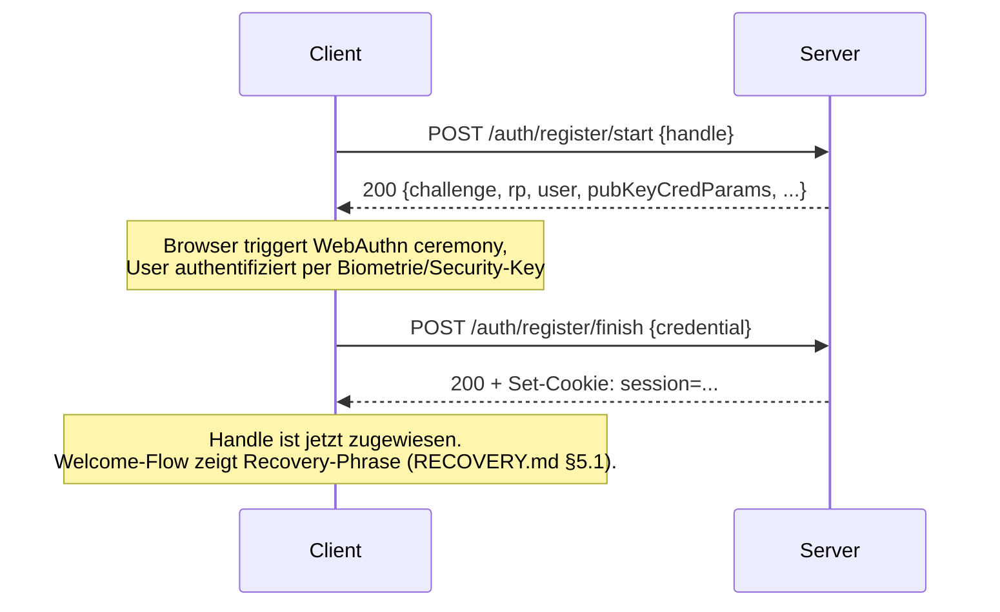
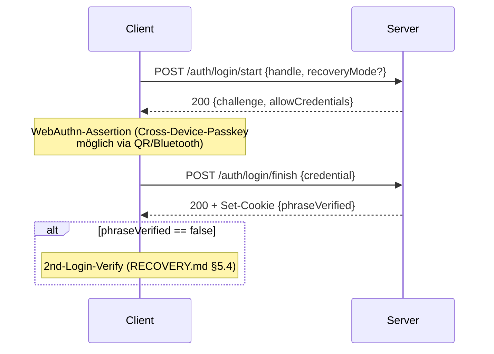

# RENEX Protocol v1

> **Open Standard für Passkey-only, AI-freie, E2E-verschlüsselte Echtzeit-Kommunikation.**
> Diese Spec ist der **normative Entry-Point** für Implementierer eines RENEX-kompatiblen
> Client oder Servers. Sie integriert [`MULTI_DEVICE.md`](./MULTI_DEVICE.md) (Multi-Device-Layer)
> und [`RECOVERY.md`](./RECOVERY.md) (BIP39-Recovery) als verbindliche Sub-Specs.

**Status:** Draft v1
**Version:** 1.0 (Protocol-ID: `renex/1`)
**Letzte Aktualisierung:** 2026-05-09
**Autor:** Bruno Hochstrasser
**Verbindlich ab:** Phase 2 (Open-Source-Launch)
**Lizenz:** MIT/Apache 2.0 Dual (Spec & Reference-Frontend), AGPL v3 (Reference-Server)

---

## Inhaltsverzeichnis

1. [Übersicht & Scope](#1-übersicht--scope)
2. [Konventionen](#2-konventionen)
3. [Identität](#3-identität)
4. [Krypto-Primitives](#4-krypto-primitives)
5. [Transport & Wire-Format](#5-transport--wire-format)
6. [Authentication](#6-authentication)
7. [Konversations-Modell](#7-konversations-modell)
8. [Multi-Device-Layer](#8-multi-device-layer)
9. [Message-Envelope](#9-message-envelope)
10. [Control-Messages](#10-control-messages)
11. [Signatur-Schema](#11-signatur-schema)
12. [WebSocket-Events](#12-websocket-events)
13. [Recovery-Layer](#13-recovery-layer)
14. [Versioning & Forward-Compat](#14-versioning--forward-compat)
15. [Conformance](#15-conformance)
16. [Decision Log](#16-decision-log)
17. [Offene Items](#17-offene-items)

---

## 1. Übersicht & Scope

### 1.1 Was diese Spec definiert

RENEX Protocol v1 (kurz: **`renex/1`**) beschreibt das Wire-Protokoll zwischen einem
RENEX-Client und einem RENEX-Server. Konform ist eine Implementierung, wenn sie:

1. die in §6 beschriebene Passkey-only-Authentifizierung umsetzt,
2. die in §9 beschriebenen Message-Envelopes erzeugt/akzeptiert,
3. die in §10 beschriebenen Control-Messages versteht,
4. den Multi-Device-Layer ([`MULTI_DEVICE.md`](./MULTI_DEVICE.md)) implementiert,
5. den Recovery-Layer ([`RECOVERY.md`](./RECOVERY.md)) implementiert oder mit
   einem Server interoperabel ist, der ihn implementiert.

### 1.2 Was diese Spec NICHT definiert

- Server-interne Storage-Layer (D1/KV/R2-Mapping ist Reference-Implementation, kein Standard).
- Frontend-UI (Settings-Layout, Toast-Texte etc. — siehe [`MULTI_DEVICE.md`](./MULTI_DEVICE.md) §12).
- Voice/Video-Signalisierung (separate Spec `VOICE.md`, geplant Phase 3).
- Server-Server-Federation (out of scope für v1; Roadmap Phase 9+).

### 1.3 Verhältnis zu anderen Standards

| Standard | Rolle in RENEX |
|---|---|
| [WebAuthn / FIDO2](https://www.w3.org/TR/webauthn-2/) | Identitäts-Anker. Passkey IST der Account. |
| [BIP39](https://github.com/bitcoin/bips/blob/master/bip-0039.mediawiki) | Recovery-Phrase-Generierung & -Eingabe. |
| [WebCrypto API](https://www.w3.org/TR/WebCryptoAPI/) | Krypto-Primitives auf Client. |
| [RFC 8259](https://www.rfc-editor.org/rfc/rfc8259) | JSON-Wire-Format. |
| [RFC 6455](https://www.rfc-editor.org/rfc/rfc6455) | WebSocket-Transport. |
| [Signal Protocol](https://signal.org/docs/) | Geplante Phase-8-Migration (post-Beta). v1 nutzt CMK-Epochs. |

### 1.4 Relation zu Reference-Implementation

Die Reference-Implementation läuft auf Cloudflare Workers + D1 + KV + R2 + Durable Objects.
Server-Pfade wie `renex-db` oder Routenfile-Namen sind **informativ**, nicht normativ.
Jeder konforme Server **MUSS** die in §6, §9, §10 spezifizierten HTTP/WS-Endpoints exposen.

---

## 2. Konventionen

### 2.1 Schlüsselwörter

Schlüsselwörter **MUSS**, **DARF NICHT**, **SOLL**, **SOLL NICHT**, **KANN** sind im Sinne
von [RFC 2119](https://www.rfc-editor.org/rfc/rfc2119) zu interpretieren.

### 2.2 Encoding

- Alle JSON-Bodies sind UTF-8 ohne BOM.
- Binärfelder in JSON werden als **standard Base64** ([RFC 4648 §4](https://www.rfc-editor.org/rfc/rfc4648#section-4)) übertragen — **nicht** Base64URL — sofern nicht explizit anders genannt.
- Strings sind NFC-normalisiert, mit Ausnahme der BIP39-Phrase (NFKD, siehe [`RECOVERY.md`](./RECOVERY.md) §4.5).

### 2.3 Zeitstempel

Alle Zeitstempel sind **Unix-Millisekunden** (Number, kein String) in UTC.
Server-Truth-of-Time. Clients **DÜRFEN NICHT** eigene Zeitstempel an Server senden, außer
explizit als `clientTs` markiert; in solchen Fällen wird der Server-`ts` verbindlich.

### 2.4 Versions-Token

Die Wire-Version wird im Feld `v` (number) eingebettet, abhängig vom Kontext:
- `bundle.v` → Recovery-Bundle-Schema (siehe [`RECOVERY.md`](./RECOVERY.md) §3.1).
- `messages.v` → Message-Envelope-Schema (siehe §9).
- `protocol`-Version selbst wird im WebSocket-Hello und im HTTP-Header `X-RENEX-Protocol: renex/1` ausgehandelt.

---

## 3. Identität

### 3.1 Handle

Der **Handle** ist der eindeutige öffentliche Identifier eines Users.

| Eigenschaft | Wert |
|---|---|
| Erlaubte Zeichen | `a-z 0-9 _` |
| Erstes Zeichen | `a-z` (kein Digit, kein Underscore) |
| Länge | 3–32 |
| Case | **lowercase erzwungen** (Server lowercased Inputs) |
| Eindeutigkeit | global pro Server-Domain |
| Wechsel | nicht unterstützt in v1 |

Regex (informativ): `^[a-z][a-z0-9_]{2,31}$`

### 3.2 Account-Anker

Der Account ist an die WebAuthn-Credential-Sammlung gebunden. Es gibt **kein Passwort,
keine Email, keine Telefonnummer**. Recovery existiert ausschließlich über die
BIP39-Phrase (siehe [`RECOVERY.md`](./RECOVERY.md)).

### 3.3 Pubkey-Bindings

Pro Device hat ein User zwei Pubkeys, die unter dem Handle veröffentlicht werden:

| Pubkey | Zweck | Algorithmus |
|---|---|---|
| **Inbox-Pubkey** | CMK/GSK-Wrapping (Asymmetric-Key-Exchange) | ECDH P-256 (JWK) |
| **Sig-Pubkey** | Message-Signaturen | ECDSA P-256 (JWK) |

Persistenz und Distribution siehe [`MULTI_DEVICE.md`](./MULTI_DEVICE.md) §2.

### 3.4 Discovery

Ein Client **MUSS** die Pubkey-Liste eines Peers durch
`GET /e2e/inbox/get?user=<handle>` abrufen, bevor er erstmals eine CMK an ihn verteilt
oder eine Message verschlüsselt. Der Server **MUSS** nur Devices mit `state ∈ {syncing, active}` zurückgeben.

---

## 4. Krypto-Primitives

### 4.1 Algorithmen-Tabelle

| Verwendung | Algorithmus | Parameter | Quelle |
|---|---|---|---|
| Pubkey-Wrap (Inbox) | ECDH | P-256 | WebCrypto |
| Pubkey-Sign (Sig) | ECDSA | P-256, SHA-256 | WebCrypto |
| Symmetrische Verschlüsselung (CMK/GSK/Bundle) | AES-GCM | 256-bit Key, 96-bit IV | WebCrypto |
| Key-Derivation aus Phrase | PBKDF2-SHA256 | 600 000 Iterationen, 16-byte Salt | OWASP 2023 |
| Recovery-Phrase | BIP39 | 12 Wörter, 128-bit Entropy, English Wordlist | BIP39 |
| RNG | `crypto.getRandomValues()` | — | WebCrypto |
| Hash | SHA-256 | — | WebCrypto |

**Nicht erlaubt** in `renex/1`:
- AES-CBC, AES-CTR (nur AES-GCM für Authenticated Encryption).
- RSA-Wrap (nur ECDH für Inbox-Pubkey).
- SHA-1, MD5.
- PBKDF2-Iterations < 600 000.

### 4.2 CMK / GSK

| Schlüssel | Bedeutung | Lebensdauer |
|---|---|---|
| **CMK** (Conversation Master Key) | symmetrischer Key pro DM-Konversation | bis User-Revoke (Forward-Secrecy-Rotation, siehe [`MULTI_DEVICE.md`](./MULTI_DEVICE.md) §3.2) |
| **GSK** (Group Sender Key) | symmetrischer Key pro Sender pro Gruppe (Sender-Keys-Pattern) | bis Group-Membership-Change |

Beide sind 256-bit, lokal in IndexedDB gecached, und werden für Peer-Devices via
deren Inbox-Pubkey gewrappt vor Distribution.

### 4.3 IV-Strategie

AES-GCM erfordert IV-Uniqueness pro Key. Clients **MÜSSEN** für jede Verschlüsselung
eine fresh 12-byte IV via `crypto.getRandomValues()` generieren. **DARF NICHT**
Counter-basierte oder time-derivierte IVs nutzen.

### 4.4 AAD-Bindings

Wo Authenticated-Encryption-mit-Associated-Data (AAD) genutzt wird, ist die AAD-Form
spec'd:

| Kontext | AAD |
|---|---|
| Recovery-Bundle (v=2) | `renex:bundle:<handle>` (siehe [`RECOVERY.md`](./RECOVERY.md) §4.4) |
| Message-Payload | (keine AAD in v1; `sig` deckt Integrity ab — siehe §11) |
| CMK-Wrap | (keine AAD in v1) |

---

## 5. Transport & Wire-Format

### 5.1 HTTP

- **Schema:** HTTPS only. HTTP **DARF NICHT** akzeptiert werden außer als 308-Redirect.
- **Methods:** GET (idempotent reads), POST (state-mutating), DELETE (account-level).
- **Content-Type:** `application/json` für JSON-Bodies, `application/octet-stream` für
  Recovery-Bundle-Bytes.
- **Auth:** HttpOnly-Session-Cookie nach erfolgreichem WebAuthn-Login.
- **CSRF:** State-mutating Requests **MÜSSEN** vom Server gegen den `Origin`-Header
  geprüft werden.

### 5.2 WebSocket

- **Schema:** WSS only.
- **Auth:** WS-Ticket aus `GET /auth/ws-ticket` (kurze Lifetime, signiert).
- **Format:** JSON-Frames. Server-Push für Events; Client→Server in v1 nur
  Pings/Heartbeats. Sende-Pfade laufen über REST (`POST /chat/send`).
- **Reconnect:** exponentielles Backoff, mind. 1s, max 30s.

### 5.3 Rate-Limiting

Server **MUSS** Per-Handle-Rate-Limits durchsetzen. Konkrete Limits siehe
[`MULTI_DEVICE.md`](./MULTI_DEVICE.md) §6 und [`RECOVERY.md`](./RECOVERY.md) §8.
Bei Überschreiten: HTTP `429 Too Many Requests` mit `Retry-After`-Header.

### 5.4 Error-Format

```json
{ "error": "<machine-readable code>", "detail": "<optional human string>" }
```

Codes sind kebab-case oder snake_case ASCII (`device_limit_reached`, `salt_exists`,
`Not authenticated`, …). Clients **MÜSSEN** sich an `error`-Codes orientieren, nicht an
HTTP-Status allein.

---

## 6. Authentication

### 6.1 Register-Flow



### 6.2 Login-Flow



### 6.3 Session-Probe

`GET /auth/session` returnt das aktuelle Session-Objekt:

```json
{
  "ok": true,
  "handle": "bertha004",
  "phraseVerified": true,
  "tier": "free"
}
```

`tier` ist forward-compat-reserviert (siehe [`MULTI_DEVICE.md`](./MULTI_DEVICE.md) §11).

### 6.4 Logout

`POST /auth/logout` löscht die Server-Session und `clear`-cookied. Frontend
**SOLL** parallel den lokalen Storage aufräumen (CMKs/GSKs werden lokal cached und
können bei Logout optional gelöscht werden).

### 6.5 Account-Delete

`DELETE /account` cascades:
- alle Devices revoken (siehe [`MULTI_DEVICE.md`](./MULTI_DEVICE.md) §3),
- Recovery-Bundle + Salt löschen (siehe [`RECOVERY.md`](./RECOVERY.md) §10.3),
- WebAuthn-Credentials revoken,
- Profile/Terms/Push-Subscriptions löschen,
- Messages-History für eigene Convos löschen.

### 6.6 Pflicht-Endpoints (normativ)

| Method | Path | Beschreibung |
|---|---|---|
| POST | `/auth/register/start` | WebAuthn-Registration-Challenge |
| POST | `/auth/register/finish` | Credential persistieren |
| POST | `/auth/login/start` | WebAuthn-Auth-Challenge (`recoveryMode`-Flag optional) |
| POST | `/auth/login/finish` | Assertion verifizieren, Session ausstellen |
| GET | `/auth/session` | Aktuelle Session-Info |
| GET | `/auth/ws-ticket` | Kurz-lebiges Token für WSS-Connect |
| POST | `/auth/logout` | Session beenden |
| DELETE | `/account` | Account löschen (cascading) |

---

## 7. Konversations-Modell

### 7.1 Konversations-IDs

| Typ | `convoId`-Format | Beispiel |
|---|---|---|
| **DM** | `<lowerHandle>:<higherHandle>` (alphabetisch sortiert) | `alice:bertha004` |
| **Gruppe** | UUID v4 (server-generiert) | `b0ff7e44-...` |

DM-`convoId` ist ohne Server-State ableitbar, wenn beide Handles bekannt sind.
Gruppen-IDs **MÜSSEN** durch den Server-Endpoint zur Gruppen-Erstellung generiert werden.

### 7.2 Authority-Konzept

Bei DMs ist die **Authority** der User mit dem alphabetisch kleineren Handle. Authority
ist verantwortlich für:
- CMK-Generierung beim Erst-Kontakt,
- CMK-Distribution bei Membership-Änderungen (Add-Device, Revoke).

Details siehe [`MULTI_DEVICE.md`](./MULTI_DEVICE.md) §1 + §4.4.

### 7.3 Mitgliedschaft

| Typ | Quelle |
|---|---|
| DM | implizit aus `convoId` |
| Gruppe | `conversation_members` Tabelle (Server-State); Client erhält Liste über `GET /group/<id>/members` (Phase 1C) |

### 7.4 Sichtbarkeitsregeln

- Server **DARF NICHT** Plaintext von Messages lesen können.
- Server **DARF** Metadaten lesen: Sender-Handle, Empfänger-Handle/`convoId`,
  Timestamp, Message-ID, `type`-Feld bei Control-Messages, Reactions (Emoji + Voter-Handle).
- Reactions sind in v1 **nicht E2E-verschlüsselt** (Open Item, siehe §17).

---

## 8. Multi-Device-Layer

Der Multi-Device-Layer ist normativ in [`MULTI_DEVICE.md`](./MULTI_DEVICE.md) festgelegt
und Bestandteil von `renex/1`. Diese Sektion fasst die Pflicht-Endpoints zusammen;
die Semantik (State-Machine, Edge-Cases, Limits) steht in der referenzierten Spec.

### 8.1 Pflicht-Endpoints (normativ)

| Method | Path | Beschreibung | Sub-Spec |
|---|---|---|---|
| POST | `/e2e/inbox/upload` | Inbox + Sig-Pubkey + Device-Name registrieren | [§4.1](./MULTI_DEVICE.md#41-add-device-flow) |
| GET | `/e2e/inbox/get?user=<h>` | Pubkey-Liste eines Peers (alle aktiven Devices) | [§2.2](./MULTI_DEVICE.md#22-kv--hot-cache-für-send-path-bestehend-leicht-angepasst) |
| POST | `/e2e/inbox/remove` | Eigenes Device revoken | [§4.3.1](./MULTI_DEVICE.md#431-user-revoke-sicherheits-aktion) |
| POST | `/e2e/inbox/heartbeat` | `last_seen` updaten + `syncing → active` | [§3.1](./MULTI_DEVICE.md#31-transitions-tabelle) |
| GET | `/e2e/devices/list` | Eigene Device-Liste (Settings-UI) | [§12](./MULTI_DEVICE.md#12-settings-ui-spec) |
| POST | `/e2e/cmk/store` | CMK-Wraps für Peer-Devices ablegen | [§4.4](./MULTI_DEVICE.md#44-cmk-distribution-flow) |
| GET | `/e2e/cmk/fetch?from=<h>&deviceId=<id>` | CMK für eigenes Device holen | [§4.4](./MULTI_DEVICE.md#44-cmk-distribution-flow) |
| POST | `/e2e/group-gsk/store` | GSK-Wraps für eigene Devices in Gruppe | [§5 Edge 8](./MULTI_DEVICE.md#5-edge-cases) |
| GET | `/e2e/group-gsk/fetch?groupId=<id>&deviceId=<id>` | GSK für eigenes Device in Gruppe | — |
| GET (legacy) | `/chat/keys/get?user=<h>` | Single-Pubkey-Read (deprecated, Phase 1B.5 entfernt) | [§7.6](./MULTI_DEVICE.md#76-backward-compat) |

### 8.2 Verbindlich für Konformität

Eine konforme Implementierung **MUSS**:
- die State-Machine `new → syncing → active → revoked` umsetzen (siehe [`MULTI_DEVICE.md`](./MULTI_DEVICE.md) §3),
- den 7-Tage-Recovery-Cutoff beim Add-Device-Flow erzwingen ([§4.4.3](./MULTI_DEVICE.md#443-rotation-bei-user-revoke-siehe-431)),
- CMK-Rotation **nur** bei `revoked_by='user'` triggern (nicht bei `auto`/`self`),
- die Per-Tier-Device-Limits durchsetzen (Free=5, Pro=10).

---

## 9. Message-Envelope

### 9.1 Send: `POST /chat/send`

Sender-Side-Wire-Format (informelle TS-Notation):

```ts
type SendBody = {
  to: string;              // peer handle (DM) oder groupId (UUID)
  ts?: number;             // optional clientTs; Server-ts ist authoritative
  v?: number;              // Envelope-Version, default 1
  type?: ControlType;      // wenn gesetzt: Control-Message (siehe §10)
  deviceId: string;        // Sender-Device-ID (8–64 chars)
  sig?: string;            // base64 ECDSA P-256 Signatur (siehe §11)

  // E2E-Felder — entweder (ivB64+ctB64) ODER payloads, abhängig vom convo-Typ:
  ivB64?: string;          // 12-byte IV, base64 (max ~24 chars)
  ctB64?: string;          // AES-GCM Ciphertext, base64 (max ~64 KB)
  payloads?: Array<{       // Multi-Device-Wrapped Payloads (Sender-Keys-Modus)
    deviceId: string;
    ivB64: string;
    ctB64: string;
  }>;

  // Group-Sender-Keys-Felder (Gruppen):
  sid?: string;            // Sender-Key-ID (max 16 chars)
  epoch?: number;          // Sender-Key-Epoch (integer ≥ 0)
  rotationIndex?: number;  // Rotation-Counter (integer 0..2^31-1)

  // Reply-Threading (alle E2E-encrypted, optional):
  replyToId?: string;
  replyFrom?: string;
  replyIv?: string;
  replyCt?: string;
  replyRotationIndex?: number;

  // Attachments:
  attachmentKey?: string;  // R2-Key (Server-cached, kein Plaintext)
  attachmentType?: string;
};
```

### 9.2 Server-Response

```json
{ "ok": true, "msgId": "01HVZ...", "ts": 1714305600000 }
```

`msgId` ist server-generiert (ULID empfohlen). Client **MUSS** den Server-`ts`
übernehmen und eigene `clientTs`-Werte verwerfen für Anzeige.

### 9.3 Push-Path

Nach Persistenz pushed der Server an alle aktiven Empfänger-Devices via WebSocket
einen Frame der Form:

```json
{
  "kind": "msg",
  "msg": { /* Server-Message-Row, gleiche Felder wie /chat/list result */ }
}
```

Frame-Schema-Variation siehe Reference-Server. Konformität verlangt: Empfänger
**MUSS** den Frame als Drop-In für `/chat/list`-Resultate behandeln können.

### 9.4 Pflicht-Felder

| Convo-Typ | Pflicht | Optional |
|---|---|---|
| **DM (Multi-Device-CMK)** | `to`, `ivB64`, `ctB64`, `deviceId`, `sig` | `replyTo*`, `attachment*` |
| **Group (GSK)** | `to`, `payloads[]` ODER `ivB64`+`ctB64`, `sid`, `epoch`, `deviceId`, `sig` | `replyTo*`, `attachment*`, `rotationIndex` |
| **Control-Message** | `to`, `type`, `deviceId` | siehe §10 für `type`-spezifische Felder |

### 9.5 Bytegrenzen (Server-enforced)

| Feld | Max |
|---|---|
| `ivB64` | 24 chars |
| `ctB64` | 64 KB (base64) |
| `sid` | 16 chars |
| `type` | 32 chars |
| `sig` | 256 chars (base64) |
| `deviceId` | 64 chars |
| `payloads[]` | je 256 chars Pro-Sub-Felder, max 50 Einträge |

### 9.6 Lese-Pfad: `GET /chat/list`

Returnt eine Seite Messages für eine Konversation (DM oder Group). Wire-Format:

```json
{
  "with": "<peer-handle oder groupId>",
  "messages": [ { /* Message-Row, siehe §9.4 plus id, from, to, ts, status */ } ],
  "nextCursor": <ts-of-oldest> | null,
  "reactions": { "<msgId>": { "<emoji>": ["<handle>", ...] } }
}
```

Cursor-Pagination: `?with=<id>&cursor=<ts>&limit=<1-100>`. `cursor=null` bedeutet
„ältere Seite holen". Resultate sind in chronologischer Reihenfolge (älteste zuerst).

---

## 10. Control-Messages

Control-Messages laufen über den gleichen `POST /chat/send`-Endpoint, sind aber durch
das `type`-Feld markiert. Sie tragen kein User-Plaintext, sondern Crypto-Material oder
Protokoll-Signale. Server **MUSS** das `type`-Feld erlauben, **DARF NICHT** den
Plaintext-Inhalt inspizieren.

### 10.1 Erlaubte Types (v1)

| `type` | Bedeutung | Pflichtfelder |
|---|---|---|
| `cmk` | CMK-Distribution direkt im Send-Path (Fallback) | `payloads[]`, `deviceId` |
| `cmk_req` | Empfänger bittet Sender um CMK-Wrap | `deviceId` |
| `cmk_unavailable` | Sender informiert Empfänger: CMK nicht verteilbar | `deviceId` |
| `cmk_rotate` | Authority kündigt CMK-Rotation an | `deviceId` |
| `cmk_reset` | Reset von Konversations-State (z.B. nach Auth-Switch) | `deviceId` |
| `epoch_rotate` | GSK-Epoch-Increment in Gruppe | `sid`, `epoch`, `deviceId` |
| `gsk` | GSK-Distribution an einzelnes Peer-Device | `payloads[]`, `sid`, `epoch`, `deviceId` |
| `request_gsk` | Empfänger bittet um GSK-Re-Wrap | `sid`, `deviceId` |
| `auto_delete_set` | Auto-Delete-Timer für Konversation setzen | `deviceId` |

### 10.2 Validation

- `type` **MUSS** in obiger Whitelist sein. Unbekannte `type` führen zu HTTP `400`.
- Control-Messages haben **eigene Rate-Limits** auf Server-Seite (typisch
  60/min/Sender), getrennt von User-Messages.
- `e2e=false`-Markierung mit `payloads[]` ist legitim für `gsk`/`request_gsk`/`cmk_req`
  (wo der Inhalt selbst Crypto-Material trägt, nicht E2E-encrypted Plaintext).

### 10.3 Forward-Compat

Implementierungen **SOLL** unbekannte `type`-Werte robust behandeln (kein Crash),
**aber DÜRFEN NICHT** sie weiter ausliefern, wenn der Server sie nicht versteht —
sonst Silent-Drop-Risiko.

---

## 11. Signatur-Schema

### 11.1 Was wird signiert

Pro Message berechnet der Sender:

```
toSign = utf8(`${convoId}|${ts}|${ctB64}`)
signature = ECDSA-P256-SHA256(senderSigPriv, toSign)
sig = base64(signature)   // ~88 chars
```

- `convoId` aus §7.1
- `ts` ist der Server-`ts`, nicht `clientTs` (Sender muss bei `clientTs`-only-Mode
  optimistisch signieren und bei Mismatch im Receive-Path die Verifikation skippen).
  Empfehlung: Sender pre-encrypted, Server fügt `ts` hinzu, Sender signiert
  nachträglich beim WS-Ack — pragmatisch akzeptiert: Sender signiert mit `clientTs`,
  Receiver re-baut `toSign` mit `clientTs`. **Open Item, siehe §17.**
- Bei `payloads[]` (Sender-Keys-Modus) wird über das **erste** `ctB64` signiert
  (alle Payloads sind Wraps desselben Plaintexts via verschiedener IV+Pubkeys).

### 11.2 Empfänger-Verifikation

```ts
const sigPub = await fetchSigPub(senderHandle, msg.deviceId);
const ok = await crypto.subtle.verify(
  { name: "ECDSA", hash: "SHA-256" },
  sigPub,
  base64Decode(msg.sig),
  utf8Encode(`${convoId}|${msg.ts}|${msg.ctB64}`)
);
```

Bei `ok === false`: Message **MUSS** als „untrusted" markiert werden. Empfehlung
v1: nicht hard-failen, aber UI-Warnung anzeigen + Sentry-Event loggen. Hard-fail
ab v2 sobald Sig-Coverage > 99% gemessen.

### 11.3 Trust-Bootstrapping (TOFU)

Sig-Pubkeys werden bei Add-Device hochgeladen und ungeprüft akzeptiert (Trust on
First Use). Verifikations-UI (Safety-Numbers à la Signal) ist **nicht** in v1 —
Roadmap Phase 8 bei Signal-Migration.

---

## 12. WebSocket-Events

Server-Push-Events (Frame-Schema, JSON):

| `kind` | Trigger | Payload |
|---|---|---|
| `msg` | Neue Message in Convo des Receivers | `{kind:"msg", msg:{...}}` (siehe §9.3) |
| `device_added` | Peer hat neues Device hinzugefügt | `{kind:"device_added", from, to, ts}` |
| `device_removed` | Peer hat Device revoked (oder Self-Cron) | `{kind:"device_removed", from, to, deviceId, reason, ts}` |
| `presence` | Online-Status-Update | `{kind:"presence", who, online, ts}` |
| `typing` | Typing-Indicator | `{kind:"typing", from, to, ts}` |
| `read` | Lesebestätigung | `{kind:"read", from, to, upToMsgId, ts}` |
| `pong` | Heartbeat-Antwort | `{kind:"pong", ts}` |

**Pflicht in v1:** `msg`, `device_added`, `device_removed`. Andere sind
implementation-defined und **SOLL** ignoriert werden, wenn unbekannt.

---

## 13. Recovery-Layer

Der Recovery-Layer ist normativ in [`RECOVERY.md`](./RECOVERY.md) festgelegt und
Bestandteil von `renex/1`. Konforme Server **MÜSSEN** die folgenden Endpoints
exposen:

| Method | Path | Beschreibung |
|---|---|---|
| POST | `/e2e/recovery/init` | Salt einmalig schreiben |
| GET | `/e2e/recovery/bundle` | Salt + Ciphertext-Blob laden |
| POST | `/e2e/recovery/bundle` | Verschlüsselten Blob aktualisieren (binary body) |
| POST | `/e2e/recovery/verify` | Phrase-Verified-Flag setzen |
| GET | `/e2e/recovery/status` | Verified/Shown-Status lesen |

Konforme Clients **MÜSSEN**:
- BIP39-12-Wort-Phrase nach §4.1 von [`RECOVERY.md`](./RECOVERY.md) generieren,
- den 600 000-Iterations-PBKDF2-MasterKey nutzen (siehe §4.5 dort),
- Bundle-Format v=2 mit AAD-Binding (`renex:bundle:<handle>`) schreiben (siehe §4.4 dort),
- die 2nd-Login-Verify-UX umsetzen (siehe §5.4 dort).

---

## 14. Versioning & Forward-Compat

### 14.1 Versions-Achsen

| Achse | Wo | Regel |
|---|---|---|
| **Protocol-ID** | HTTP-Header `X-RENEX-Protocol`, WS-Hello | `renex/1` für diese Spec. Major-Bumps brechen Wire-Format. |
| **Envelope-`v`** | `messages.v` in `/chat/send` Body | Default 1. Server **MUSS** unbekannte `v` mit `400 unsupported_envelope_version` ablehnen. |
| **Bundle-`v`** | Recovery-Bundle Plaintext | Siehe [`RECOVERY.md`](./RECOVERY.md) §3.1 + §4.4. |

### 14.2 Breaking vs. Non-Breaking Changes

**Non-Breaking (allowed innerhalb `renex/1`):**
- Neue optionale Felder in JSON-Bodies (Server **MUSS** unbekannte Felder ignorieren).
- Neue WebSocket-`kind`-Events (Client **SOLL** unbekannte ignorieren).
- Neue Rate-Limits (Client muss `429` ohnehin handlen).

**Breaking (erfordert `renex/2`):**
- Änderung der Krypto-Algorithmen-Tabelle (§4.1).
- Änderung der Pflicht-Felder in §9.4.
- Removal von Pflicht-Endpoints (§6.6, §8.1, §13).

### 14.3 Negotiation

Client sendet `X-RENEX-Protocol: renex/1`. Server antwortet mit gleichem Header.
Bei Mismatch: Server **MUSS** `426 Upgrade Required` returnen mit `Upgrade: renex/2`
o.ä. — Reservierung für zukünftige Migration.

---

## 15. Conformance

### 15.1 Conformance-Profile

`renex/1` definiert zwei Profile:

| Profil | Verbindlich für | Inhalt |
|---|---|---|
| **`renex/1-client`** | Client-Implementierungen (Web/Native) | §3, §4, §5, §6 (alle Endpoints aufrufen), §8, §9, §10, §11, §13 |
| **`renex/1-server`** | Server-Implementierungen | §3, §4 (kann nicht-WebCrypto-Lib nutzen), §5, §6 (alle Endpoints exposen), §8 (alle Endpoints exposen), §10 (Whitelist erzwingen), §13 |

### 15.2 Conformance-Test-Suite (geplant)

Ein konformer Server **SOLL** die public RENEX-Conformance-Test-Suite bestehen
(Repo: `github.com/renex/conformance`, **TBD**, Phase 2 deliverable):

- **Auth-Suite:** WebAuthn-Roundtrip, Session-Cookie-Lifecycle, Logout, Account-Delete-Cascade.
- **Multi-Device-Suite:** Add-Device-Flow inkl. CMK-Distribution, User-Revoke
  inkl. Rotation, Auto-Revoke, 7-Tage-Cutoff, 5×5-Stress-Test.
- **Group-Multi-Device-Suite:** GSK-Re-Distribution bei Peer-Device-Add,
  Race-Schutz für Self-Device-Add, Sender-Sig-Verify (siehe
  [`GROUPS_MULTIDEVICE.md`](./GROUPS_MULTIDEVICE.md) §6).
- **Recovery-Suite:** Phrase-Generation, PBKDF2-Determinismus, Bundle-Round-Trip,
  AAD-Binding, Brute-Force-Cooldown, Account-Delete-Cleanup.
- **Wire-Suite:** Bytegrenzen (§9.5), Control-Whitelist (§10.1), Sig-Verify (§11.2).

### 15.3 Akzeptanzkriterium für `renex/1` Conformance-Stamp

Eine Implementierung darf den Conformance-Stamp tragen, wenn:
- alle Pflicht-Endpoints exposiert sind und in der Test-Suite grün sind,
- keine Plaintext-Logs von Message-Bodies, CMKs, GSKs, Phrases produziert werden,
- alle Krypto-Konstanten aus §4.1 und [`RECOVERY.md`](./RECOVERY.md) §4.5 unverändert sind,
- die State-Machine aus [`MULTI_DEVICE.md`](./MULTI_DEVICE.md) §3 vollständig
  implementiert ist (kein Skip von Transitions).

---

## 16. Decision Log

| Datum | Entscheidung | Optionen | Pick | Rationale |
|---|---|---|---|---|
| 2026-05-09 | Initial-Draft Protocol-Spec | (A) Inline alles / (B) Entry-Point + Sub-Specs | **B** | Multi-Device + Recovery sind bereits eigenständig; Duplikation = Drift-Risiko. |
| 2026-05-09 | E2E vs. Send-Path-Performance | (A) Per-Message N-Encrypt / (B) CMK + Per-Convo-Wrap | **B** | O(1) Send-Kosten statt O(N×M). Siehe [`MULTI_DEVICE.md`](./MULTI_DEVICE.md) §4.2. |
| 2026-05-09 | Sig-Algorithmus | (A) Ed25519 / (B) ECDSA P-256 | **B** | WebCrypto-Native auf allen Browsern; Ed25519 erst seit Safari 16+. |
| 2026-05-09 | Base64-Variant | (A) Standard / (B) URL-Safe | **A** | JSON-Body, kein URL-Embed nötig; Standard reduziert Encoding-Edge-Cases. |
| 2026-05-09 | Reactions E2E | (A) Plaintext / (B) E2E-encrypted | **A für v1** | Reactions sind Metadata-leakage-akzeptabel; E2E-Reactions = komplexer GSK-Handshake. Open Item für v2. |
| 2026-05-09 | Federation | (A) v1-Spec / (B) Out of scope | **B** | Single-Server-Modell für Beta; Federation Phase 9+. |
| 2026-05-09 | Sig-`ts`-Coverage | (A) Hard-Fail bei Mismatch / (B) Soft-Warn | **B** | `clientTs` vs `serverTs` Konsens noch nicht final; Hard-Fail würde Beta-User regressen. Verschärfung in v2. |

---

## 17. Offene Items

| Item | Phase | Owner-Spec |
|---|---|---|
| Conformance-Test-Suite Repo + CI-Setup | Phase 2.1 | `github.com/bruno-renex/renex-conformance` (TBD — separates Repo nach Open-Source-Launch) |
| Reactions-E2E-Encryption (heute Plaintext-Metadata) | v2 | `PROTOCOL.md` §7.4 + §10 |
| Sig-`ts`-Coverage: Hard-Fail-Cutoff (Decision-Date + Telemetrie-Threshold) | v2 | dieses Doc §11.1 |
| TOFU-Replacement: Safety-Numbers / Verifikations-UX | Phase 8 (Signal-Migration) | `PROTOCOL_v2.md` (TBD) |
| Voice/Video-Signalisierung (WebRTC SFU/TURN) | Phase 3 | `VOICE.md` (TBD) |
| Group-Member-Permission-Model (Roles, Mute, Ban) | Phase 3 | `GROUPS.md` (TBD) |
| Server-Server-Federation | Phase 9+ | `FEDERATION.md` (TBD) |
| Hardware-Attestation-Layer (Anti-Bot, VISION §2 Punkt 2) | Phase 5 | `ATTESTATION.md` (TBD) |
| Pro-Tier `tier`-Feld in Session + Server-Enforcement | Phase 3 | `MONETIZATION.md` (TBD) |
| Negotiation-Header `X-RENEX-Protocol` (heute nicht required) | v1.1 | dieses Doc §14.3 |

---

**Diese Spec ist verbindlich für die Phase-2-Open-Source-Veröffentlichung.**
**Vor Wire-Format-Änderungen: hier reinschauen.**
**Wenn die Spec falsch ist: Decision Log erweitern, dann Code anpassen — nicht umgekehrt.**
