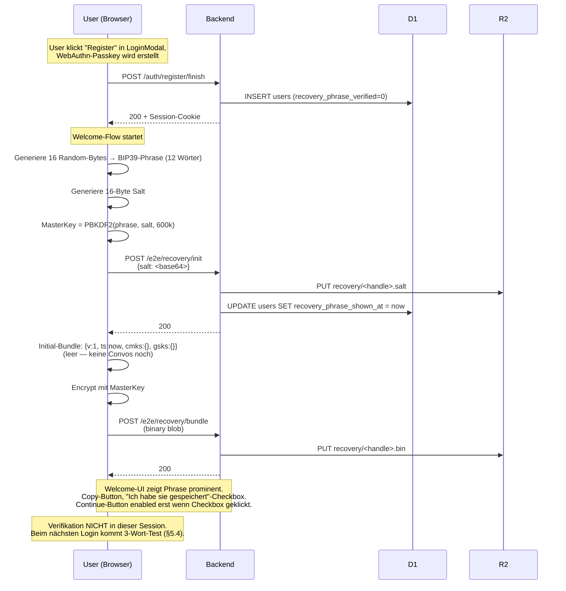
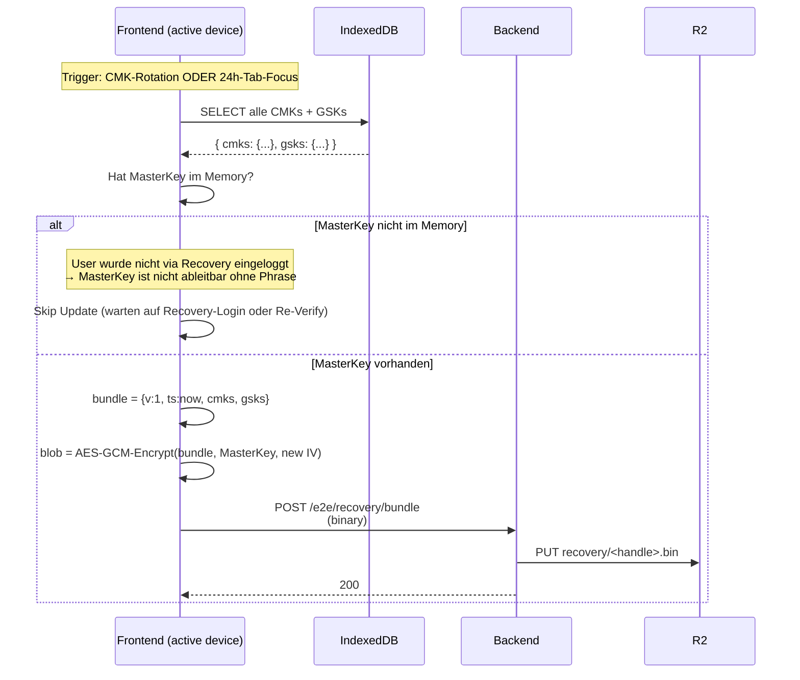
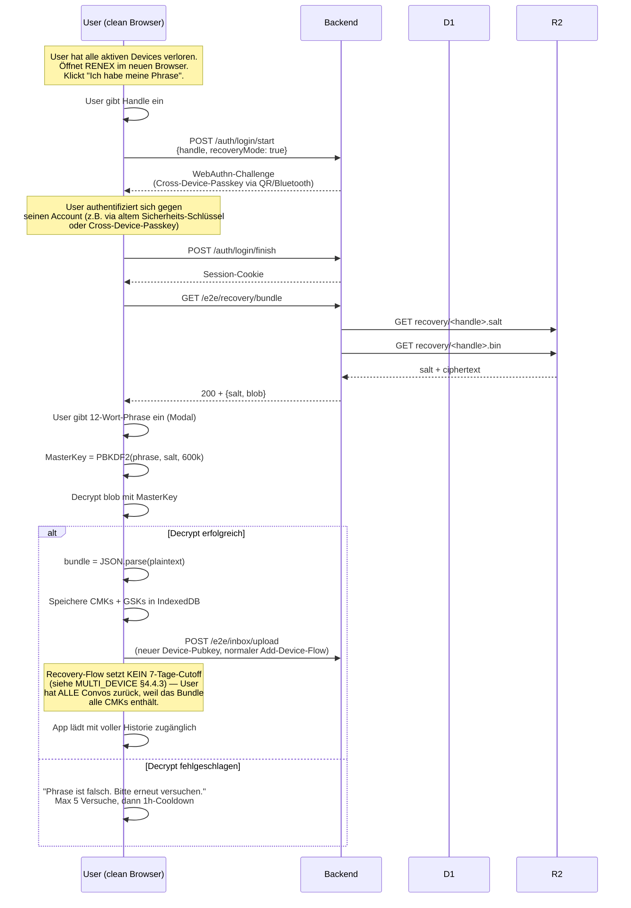
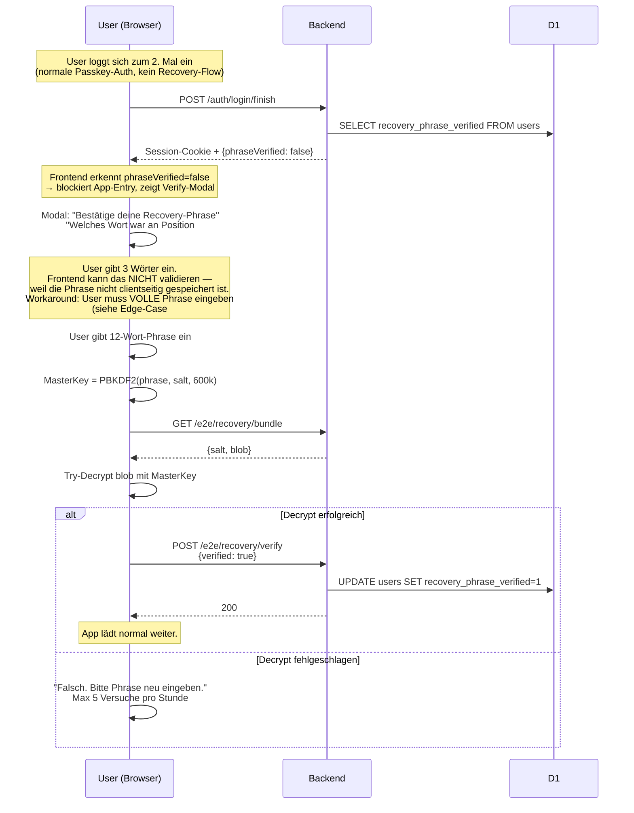

# RENEX — Recovery Spec (BIP39)

> **Phase 1B.6 Architecture**
> Verbindliche Spec für Account-Recovery via 12-Wort-Phrase nach komplettem
> Device-Verlust. Ergänzt [`MULTI_DEVICE.md`](./MULTI_DEVICE.md) §4.5 mit
> vollständigem Datenmodell, UX-Flow und Edge-Cases.

**Status:** Draft v1
**Version:** 1.0
**Letzte Aktualisierung:** 2026-04-28
**Autor:** Bruno Hochstrasser
**Verbindlich ab:** Phase 1B.6 (Juni 2026)

---

## Inhaltsverzeichnis

1. [Glossar](#1-glossar)
2. [Bedrohungs-Modell](#2-bedrohungs-modell)
3. [Datenmodell](#3-datenmodell)
4. [Krypto-Setup](#4-krypto-setup)
5. [Sequence-Diagrams](#5-sequence-diagrams)
   - 5.1 [Generierung beim Register](#51-generierung-beim-register)
   - 5.2 [Bundle-Update (Refresh)](#52-bundle-update-refresh)
   - 5.3 [Recovery auf neuem Device](#53-recovery-auf-neuem-device)
   - 5.4 [Re-Verifikation beim 2. Login](#54-re-verifikation-beim-2-login)
6. [Onboarding-UX-Spec](#6-onboarding-ux-spec)
7. [Edge-Cases](#7-edge-cases)
8. [Limits & Rate-Limits](#8-limits--rate-limits)
9. [API-Surface](#9-api-surface)
10. [Migration-Pfad](#10-migration-pfad)
11. [Test-Matrix](#11-test-matrix)
12. [Decision Log](#12-decision-log)
13. [Offene Items](#13-offene-items)

---

## 1. Glossar

| Begriff | Bedeutung |
|---|---|
| **Phrase** | 12-Wort-Phrase nach BIP39-Standard. Zufällig generiert beim Register, dem User einmal angezeigt, niemals serverseitig gespeichert. |
| **Master-Key** | 256-bit symmetrischer Schlüssel, abgeleitet via PBKDF2 aus Phrase + Salt. Verschlüsselt das Recovery-Bundle. |
| **Recovery-Bundle** | AES-GCM-verschlüsseltes JSON-Blob in R2, enthält alle CMKs + GSKs des Users. Server kann nicht entschlüsseln. |
| **Salt** | 16 zufällige Bytes pro User, in R2 als `recovery/<handle>.salt` gespeichert. Schützt gegen Pre-Computation auf gängige Phrases. |
| **Verifikations-Status** | Boolean pro User in D1: hat User die Phrase via 3-Wort-Test verifiziert. Beim 2. Login erzwungen wenn `false`. |
| **High-Stakes-Action** | Wird in dieser Spec **nicht** mehr verwendet — Verifikation ist an 2. Login gekoppelt, nicht an erste Aktion (siehe Decision Log). |

---

## 2. Bedrohungs-Modell

### Was Recovery schützt

| Szenario | Verhalten |
|---|---|
| User verliert alle aktiven Devices (Phone gestohlen + Mac kaputt) | Phrase auf neuem Device → voller Restore aller CMKs/GSKs |
| User wechselt Hardware (neues Phone, neues Laptop) | Phrase + Cross-Device-Passkey → kein Recovery nötig (siehe MULTI_DEVICE §4.1), aber als Fallback verfügbar |
| User vergisst Phrase | Account-Tod. Onboarding-UX (§6) muss das verhindern. |

### Was Recovery NICHT schützt — bewusste Tradeoffs

| Szenario | Tradeoff |
|---|---|
| **Forward Secrecy bei Phrase-Diebstahl** | Wer Phrase + Auth-Cookie hat, kann alle CMKs lesen. Bewusst akzeptiert (siehe MULTI_DEVICE §4.5.2) — Phrase ist physisch (Papier), Threat-Modell anders als gestohlenes Device. |
| **Coercion / Rubber-Hose-Cryptanalysis** | Wenn Angreifer User zwingt, die Phrase zu nennen → alle CMKs kompromittiert. Kein technischer Schutz möglich, ist Standard für jede phrase-based Recovery. |
| **Server-Operator-Compromise + Brute-Force** | Server hat Bundle + Salt. PBKDF2 mit 600k Iterationen + 2048 Bits BIP39-Entropy → Brute-Force technisch unmöglich, aber theoretisch nicht ausgeschlossen. |

### Was bewusst NICHT in dieser Spec ist

- **Keine Server-Side-Recovery** (z.B. Email-Reset). Keine Email im System (VISION §2 Punkt 1).
- **Keine Social-Recovery** (Shamir-Splits an Freunde). Komplexität nicht den Aufwand wert für Phase 1B.
- **Kein Apple-Keychain-Backup** für Master-Key. Phase post-Beta (siehe Decision Log).
- **Kein WebAuthn-PRF** als alternative Master-Key-Source. Browser-Coverage zu niedrig in 2026.

---

## 3. Datenmodell

### 3.1 R2 — Verschlüsselte User-Crypto-Backups

| Key | Inhalt | Format | Wer schreibt | Wer liest |
|---|---|---|---|---|
| `recovery/<handle>.salt` | 16 Random-Bytes | binär (16 B) | Backend bei Register (1×) | Frontend bei Recovery |
| `recovery/<handle>.bin` | AES-GCM-Ciphertext + IV-Prefix | binär (variabel, ~1–50 KB) | Frontend (verschlüsselt mit MasterKey) | Frontend (entschlüsselt mit MasterKey) |

**Format `recovery/<handle>.bin`:**

```
┌──────────┬────────────────────┐
│ IV (12B) │ AES-GCM-Ciphertext │
└──────────┴────────────────────┘
```

**Plaintext-Schema (vor Verschlüsselung) — Bundle v1:**

```json
{
  "v": 1,
  "ts": 1714305600000,
  "cmks": {
    "alice:bertha004": "<base64 32 bytes>",
    "alice:christa4":  "<base64 32 bytes>"
  },
  "gsks": {
    "<groupId-uuid>": "<base64 32 bytes>"
  }
}
```

- `v` — Bundle-Schema-Version (für Forward-Compat)
- `ts` — Unix-ms wann das Bundle geschrieben wurde (für Diagnose)
- `cmks` — DM-Konversations-Keys, Key = `convoId` (Format `min:max`-handles)
- `gsks` — Group-Sender-Keys, Key = `groupId` (UUID)

**Versioning-Regel:** Frontend erkennt unbekannte `v` → fragt User ob er sein App-Update nachziehen soll. Server kennt das Schema **nicht** und versteht nichts vom Inhalt.

### 3.2 KV — Recovery-Status pro User

**Korrektur zur ursprünglichen Spec-Annahme:** RENEX hat keine `users`-Tabelle in D1. User-Metadaten leben in KV (siehe `user:terms:<handle>`, `profile:<handle>` etc.). Recovery folgt der bestehenden Konvention.

| Key | Wert | Wer schreibt |
|---|---|---|
| `user:recovery:<handle>` | `{ verified: 0\|1, shown_at: number }` | Backend (init + verify) |

- `verified` — `0` = nicht verifiziert, `1` = User hat Decrypt-Test bestanden
- `shown_at` — Unix-ms wann Phrase zuletzt angezeigt wurde (für Re-Show-Schutz bei vergessener Verifikation)

### 3.3 D1 — keine Schema-Änderung nötig

Recovery braucht keine D1-Migration. Salt + Bundle leben in R2, Status-Flag in KV.

---

## 4. Krypto-Setup

### 4.1 Phrase-Generierung

- **Standard:** BIP39 (englisches Wordlist, 2048 Wörter)
- **Entropy:** 128 Bit → 12 Wörter
- **Library:** `@scure/bip39` (im Frontend, audited, ~10 KB)
- **Generator:** `crypto.getRandomValues(Uint8Array(16))` → BIP39-Encode

### 4.2 Master-Key-Derivation

```
MasterKey = PBKDF2(
  password    = phrase (UTF-8 encoded, NFKD-normalized),
  salt        = 16 random bytes (aus recovery/<handle>.salt),
  iterations  = 600_000,
  hash        = SHA-256,
  keyLength   = 256 bits
)
```

**Iterations-Begründung:** OWASP-2023-Empfehlung für PBKDF2-SHA256. Auf moderner Hardware ~500ms — akzeptabel beim seltenen Recovery-Flow.

**Salt-Begründung:** 16 Bytes random pro User (statt deterministisch aus Handle). Verhindert Pre-Computation-Tables für gängige Phrases × bekannte Handles. Salt wird mit Bundle zusammen in R2 gehostet — Verlust ist symmetrisch (wer Bundle hat, hat auch Salt; wer Phrase verliert, kann beides nicht mehr nutzen).

### 4.3 Bundle-Verschlüsselung

```
ciphertext = AES-GCM(
  key       = MasterKey,
  iv        = 12 random bytes (per Update neu generiert),
  plaintext = JSON.stringify(bundle)
)
output = iv || ciphertext   (concatenated)
```

**IV-Strategie:** Pro Update neue IV. AES-GCM erfordert IV-Uniqueness pro Key — bei 12-Byte-IV und 1 Update/Tag/User: 2^96 möglich, Kollisionswahrscheinlichkeit verschwindend.

### 4.4 AAD-Binding (v=2, ab 2026-05-02)

Das Bundle ist mit zusätzlichen Authentication Data (AAD) an einen bestimmten **Handle** gebunden:

```
AAD = "renex:bundle:" + handle.toLowerCase()
ciphertext = AES-GCM(key, iv, plaintext, additionalData=AAD)
```

**Bundle-Format-Versionen:**

| `bundle.v` | AAD | Eingeführt | Status |
|---|---|---|---|
| 1 | keine | Initial | Legacy — wird beim nächsten Sync auto-upgraded zu v=2 |
| 2 | `renex:bundle:<handle>` | 2026-05-02 | Current |

**Decrypt-Logik:** versucht v=2 (mit AAD) zuerst; bei Fehler Fallback auf v=1 (ohne AAD). Beide Versionen bleiben permanent supportet.

**Zweck:** Defense-in-depth gegen unwahrscheinliche, aber nicht ausgeschlossene Szenarien:
- **RNG-Salt-Kollision:** Falls zwei User je einen 16-Byte-Salt mit identischen Bytes ziehen würden (Wahrscheinlichkeit 2^-128 — astronomisch), wäre ohne AAD theoretisch ein Cross-User-Decrypt denkbar. Mit AAD: Auth-Tag matched nur wenn handle stimmt.
- **Server-Mix-up:** Falls der Server fälschlicherweise einen Bundle-Blob unter falschem Handle ausliefern würde (Bug, nicht angenommen aber abgesichert), schlägt der Decrypt sauber fehl statt mit fremdem Klartext.
- **Phrase-Wiederverwendung:** Wenn ein User dieselbe Phrase auf zwei Accounts verwendet (vom Spec verboten, aber wer's macht…), sind die Bundles trotzdem cross-Account-isoliert.

### 4.5 Audit-Notes — Constant-Reasoning

Diese Sektion dokumentiert **warum** die Krypto-Konstanten so sind. Ändere keine ohne Review.

| Konstante | Wert | Begründung | Risiko bei Änderung |
|---|---|---|---|
| `PBKDF2_ITERATIONS` | `600_000` | OWASP-2023 für PBKDF2-SHA256 mit 16-Byte-Salt. Single-CPU-GPU-Brute-Force eines 12-Wort-BIP39 (~128 bit) bleibt unrentabel. | < 100k → wirtschaftlicher Brute-Force durch Cloud-GPU-Farms möglich; > 1M → UX-Pain (Multi-Sekunden-Wartezeit auf mobilen Geräten). |
| `PBKDF2_HASH` | `'SHA-256'` | WebCrypto-Standard. Hardware-beschleunigt auf ARM/x86. | SHA-1 ist obsolet; SHA-512 ist 2× langsamer ohne Sicherheitsgewinn bei diesem Iteration-Count. |
| `MASTER_KEY_BITS` | `256` | AES-256-Standard. PBKDF2-SHA256 liefert nativ 256 Bit. | < 128 → AES-Block-Cipher-Schwellen verletzt. |
| `SALT_SIZE` | `16` | NIST SP 800-132 Minimum. Auch BIP39-konform für externe Tools. | < 8 → Pre-Computation realistisch; > 16 → keine Sicherheitsverbesserung, mehr R2-Bytes. |
| `AES_IV_SIZE` | `12` | AES-GCM-Standard (96-bit). NIST SP 800-38D. | Andere Größen verbieten sich für AES-GCM. |
| `BIP39_STRENGTH_BITS` | `128` | 12-Wort-Phrase, ~128 bit Entropy. | 256 (24 Wörter) wäre sicherer aber UX-Tod beim manuellen Tippen. |

**Salt-Eindeutigkeit (Anti-Mass-Brute-Force):**

Salt ist `randomSalt() = crypto.getRandomValues(16)` pro User, einmalig bei Register erzeugt. Gespeichert als `recovery/<handle>.salt` in R2. Backend lehnt Re-Init ab (`409 salt_exists`).

**Konsequenz:** Pro User ein eigener PBKDF2-Stream. Angreifer mit kompromittiertem R2-Snapshot kann nicht eine einzige Brute-Force-Tabelle für alle User verwenden — er muss pro Handle 600k Iterationen rechnen. Bei 100k Usern × 12-Wort-Brute-Force × 600k PBKDF2-Iter: kosmologisch.

**Phrase-zu-MasterKey: Ablauf (defensive Layer)**

```
1. User tippt 12-Wort-Phrase
2. validatePhrase()  — BIP39-Wordlist + Checksum-Check (kein Tippfehler-Pass-through)
3. normalizePhrase() — lowercase + trim + whitespace-collapse (Unicode-bypass-resistant)
4. .normalize('NFKD') — BIP39-konforme Unicode-Form (identische Bytes auf allen Plattformen)
5. PBKDF2(phrase || salt, 600k, SHA256, 256bit) → MasterKey
6. AES-GCM(MasterKey, iv, plaintext, AAD=`renex:bundle:<handle>`) → Bundle
```

**Threat-Modell-Notiz:** Die Phrase IST der Account-Recovery-Schlüssel. Verlust = unrecoverable (siehe §2). Speicherung der Phrase im Frontend ist NIE persistent (nur transient in Modal-State, ge-gc-ed bei Modal-Close). Nur die abgeleiteten Master-Key-Bytes werden gecached (`masterKey.js`, mit Device-Storage-Key umverschlüsselt).

---

## 5. Sequence-Diagrams

### 5.1 Generierung beim Register



### 5.2 Bundle-Update (Refresh)

Wird ausgelöst durch:
1. **Event-driven** — bei jeder CMK-Generierung/-Rotation (siehe MULTI_DEVICE §4.4) und jedem GSK-Setup
2. **Foreground-Daily** — wenn Tab im Vordergrund: Check ob letztes lokales Update >24h, dann Refresh



**Wichtig:** Bundle-Updates erfordern den MasterKey im Memory. Der MasterKey ist NUR verfügbar:
- (a) Direkt nach Register (kurz nach Phrase-Generierung)
- (b) Direkt nach Recovery-Login (nach Phrase-Eingabe)
- (c) Direkt nach Re-Verifikation beim 2. Login (User hat Phrase erneut eingegeben für 3-Wort-Test)

In allen anderen Sessions ist der MasterKey nicht verfügbar → Bundle-Update wird übersprungen. Das ist **akzeptabel**, weil:
- Bundle wird von mindestens einem Device pro User regelmäßig aktualisiert
- Worst-Case: User hat sein Recovery-Bundle für 30 Tage nicht gerefresht → 30 Tage alte CMKs werden restored
- Recovery ist seltener Flow (Disaster-Recovery), Stale-Bundle akzeptabel

### 5.3 Recovery auf neuem Device



### 5.4 Re-Verifikation beim 2. Login



**Wichtige Entscheidung:** Statt 3 zufälliger Wörter wird die **volle Phrase** verifiziert via Decrypt-Test. Begründung:
- Phrase ist nicht clientseitig gespeichert (sonst wäre der ganze Sinn von Phrase-only-Recovery hinfällig)
- 3-Wort-Test bräuchte serverseitige Speicherung der Phrase oder einer Hash-Variante → Krypto-Risiko
- Decrypt-Test ist äquivalent stark: User MUSS Phrase wissen, sonst Decrypt schlägt fehl

UX-Konsequenz: Der "3-Wort-Test"-Pitch im Onboarding ist **nicht** das was technisch passiert. UI sollte ehrlich sein: "Gib deine 12-Wort-Phrase ein, um zu bestätigen dass du sie gespeichert hast."

---

## 6. Onboarding-UX-Spec

### 6.1 Welcome-Flow (nach Register-Finish)

**Komponente:** `frontend/src/components/RecoveryOnboardingModal.svelte` (neu)

```
┌─ Welcome to RENEX ─────────────────────────────────┐
│                                                     │
│ 🔑 Deine Recovery-Phrase                           │
│                                                     │
│ Diese 12 Wörter sind dein einziger Weg zurück,     │
│ wenn du alle deine Geräte verlierst.               │
│                                                     │
│ ┌─────────────────────────────────────────────┐    │
│ │  1 alpha     2 bravo    3 charlie           │    │
│ │  4 delta     5 echo     6 foxtrot           │    │
│ │  7 golf      8 hotel    9 india             │    │
│ │ 10 juliet   11 kilo    12 lima              │    │
│ └─────────────────────────────────────────────┘    │
│                                                     │
│ [📋 Kopieren]  [🖨️ Drucken]                         │
│                                                     │
│ ⚠️ Wir können sie NICHT für dich wiederherstellen. │
│    Schreibe sie auf Papier, nicht ins Cloud-Drive. │
│                                                     │
│ ☐ Ich habe meine Phrase sicher notiert.            │
│                                                     │
│ [ Weiter ]                                          │
└─────────────────────────────────────────────────────┘
```

### 6.2 Verhalten

| Element | Verhalten |
|---|---|
| Phrase-Anzeige | 4×3-Grid mit Position-Nummer + Wort. Monospace-Font für gleiche Breite. |
| Copy-Button | Kopiert Phrase als Plaintext in Clipboard. Toast: "Kopiert. Lösche danach aus Clipboard!" |
| Print-Button | `window.print()` mit dedizierter Print-CSS-Layout (nur Phrase + Datum + Handle) |
| Checkbox "Ich habe gespeichert" | Continue-Button erst enabled wenn ☑ |
| Continue-Button | Setzt `recovery_phrase_shown_at = now` in D1, schließt Modal, App lädt |
| ESC / Backdrop-Click | Disabled — User MUSS interagieren |
| `recovery_phrase_verified` | Bleibt `0` — wird erst beim 2. Login gesetzt |

### 6.3 Re-Verifikation-Modal (beim 2. Login)

**Komponente:** `frontend/src/components/RecoveryVerifyModal.svelte` (neu)

```
┌─ Recovery-Phrase bestätigen ──────────────────────┐
│                                                    │
│ Bevor du fortfährst:                              │
│ Bestätige bitte einmal, dass du deine             │
│ Recovery-Phrase gespeichert hast.                 │
│                                                    │
│ Gib deine 12-Wort-Phrase ein:                     │
│                                                    │
│ ┌─────────────────────────────────────────────┐   │
│ │  1                  2                        │   │
│ │  3                  4                        │   │
│ │  ...                                         │   │
│ └─────────────────────────────────────────────┘   │
│                                                    │
│ [ Bestätigen ]   [ Phrase erneut anzeigen ]       │
└────────────────────────────────────────────────────┘
```

| Element | Verhalten |
|---|---|
| 12 Eingabefelder | Tab-Navigation, Auto-Lowercase, Live-BIP39-Wordlist-Validation pro Feld |
| Phrase-Erneut-Anzeigen-Button | Zeigt Welcome-Modal von §6.1 erneut. Nur möglich wenn `recovery_phrase_shown_at < 24h` (Anti-Replay-Schutz: Angreifer mit Session-Hijack könnte sonst Phrase erneut anzeigen lassen). Nach 24h: "Bitte logge dich auf einem anderen Gerät ein und triggere Re-Show dort." (Edge-Case 4) |
| Bestätigen-Button | Triggert Decrypt-Test (§5.4). Bei Erfolg: D1-Update + Modal schließt. |
| Failed-Decrypt | "Falsch. Versuche es nochmal." — max 5 Versuche/Stunde, dann 1h-Cooldown (Rate-Limit) |
| ESC / Backdrop-Click | Disabled — User darf App nicht ohne Verify nutzen |

### 6.4 Recovery-Login-Flow (auf neuem Device)

**Komponente:** Erweiterung von `LoginModal.svelte`

```
[ existing Login-Form ]
─────────────────────────
Alle Geräte verloren?
[ 🆘 Recovery via Phrase ]
```

→ Klick öffnet `RecoveryLoginModal.svelte` (neu) mit:
1. Handle-Input
2. Cross-Device-Passkey-Aufforderung (Browser-WebAuthn)
3. 12-Wort-Phrase-Eingabe (gleiche Komponente wie §6.3)
4. Bei Erfolg: App lädt mit vollem Restore (siehe §5.3)

---

## 7. Edge-Cases

| # | Szenario | Verhalten |
|---|---|---|
| 1 | User schließt Welcome-Modal via DevTools / Browser-Force-Close ohne ☑ | Beim nächsten Login: `recovery_phrase_shown_at != null` aber `verified=0` → Welcome-Modal wird NICHT erneut gezeigt (User hatte die Phrase bereits). Verify-Modal erscheint stattdessen. User muss Phrase erneut auf einem anderen aktiven Device anzeigen lassen oder Account verwerfen + neu registrieren. |
| 2 | User vergisst Phrase und hat 1 aktives Device | Auf aktivem Device kann User unter "Settings → Recovery" die Phrase erneut anzeigen lassen (re-derived from MasterKey-im-Memory? **Nein** — MasterKey allein gibt die Phrase nicht zurück). Daher: **Phrase ist verloren.** Trostpflaster: User kann ein neues Recovery-Setup machen — neue Phrase, neuer Salt, neues Bundle. Alte Phrase wird damit ungültig. |
| 3 | 3-Wort-Test technisch nicht implementierbar | Wir prüfen über Decrypt-Test (§5.4). UI-Text ist ehrlich: "Gib volle Phrase ein". Onboarding-Pitch in §6.1 muss das vorbereiten — kein Versprechen "nur 3 Wörter". |
| 4 | Re-Verify-Modal erscheint, aber User hat Phrase nie notiert | "Phrase erneut anzeigen"-Button funktioniert nur wenn `shown_at < 24h`. Sonst Erklär-Text: "Aus Sicherheitsgründen kannst du die Phrase nur in den ersten 24h erneut anzeigen. Logge dich auf einem anderen aktiven Gerät ein und triggere die Anzeige dort." |
| 5 | User probiert Recovery, Phrase ist falsch | Max 5 Versuche/Stunde pro Handle. Danach 1h-Cooldown (rate-limit `recovery_attempt:<handle>`). Brute-Force-Schutz auf 2048^12 ≈ 5×10^39 Kombinationen ist theoretisch redundant, aber gegen erratene gängige Phrases (z.B. "abandon abandon...") sinnvoll. |
| 6 | User macht Recovery, dann später noch ein Recovery von 2. neuem Device | Funktioniert. Beide neuen Devices laufen durch §5.3. Kein State-Konflikt — beide nutzen dasselbe Bundle. |
| 7 | Salt + Bundle-Schreib-Race (zwei Devices gleichzeitig) | R2-PUT ist last-write-wins. Salt: niemals neu geschrieben (init-only). Bundle: beide Devices encrypten die gleichen CMKs/GSKs (gleicher MasterKey) → semantisch identisch, nur unterschiedliche IV. Last-write-wins ist ok. |
| 8 | User wechselt Phrase (nach Verlust-Verdacht) | **Nicht in Phase 1B unterstützt.** Würde MasterKey-Rotation + alle CMKs/GSKs neu wrappen erfordern. Workaround heute: Account löschen + neu registrieren. Phase-2-Spec. |
| 9 | Bundle-Schema `v` ist neuer als App-Version | Frontend zeigt: "Bitte App aktualisieren, um Recovery durchzuführen." Kein Versuch zu parsen — `v`-Mismatch = abort. |
| 10 | User hat 0 Convos beim Recovery | Bundle ist `{v:1, ts, cmks:{}, gsks:{}}` — leer aber valid. Decrypt klappt, App lädt im "frischen" Zustand. Funktioniert. |
| 11 | Server hat Bundle-Daten, aber User hat sein Cookie gelöscht | Recovery-Flow erfordert Auth (§5.3 Schritt 1). Ohne Cookie: User loggt sich neu ein via Cross-Device-Passkey, dann Recovery. Standard-Auth-Pfad. |
| 12 | User-Account wird gelöscht | Bundle + Salt aus R2 löschen. Cron-Job-Schritt im bestehenden Account-Delete-Flow ergänzen (siehe §10.3). |

---

## 8. Limits & Rate-Limits

| Limit | Wert | Begründung |
|---|---|---|
| Phrase-Länge | 12 Wörter (BIP39 standard) | OWASP / BIP39-Konformität |
| Salt-Größe | 16 Bytes | Krypto-Standard, 128 Bit reichen gegen Pre-Computation |
| PBKDF2-Iterationen | 600 000 | OWASP 2023 für SHA-256 |
| Bundle-Update-Frequenz Frontend | event-driven + 1×/24h foreground | siehe §5.2 |
| Bundle-Max-Size | 256 KB | hard limit am Backend gegen R2-Abuse. 256 KB = ~2000 Convos × 32B CMK + Overhead. |
| `/e2e/recovery/init` POST | 1× pro User-Lifetime | Salt darf nur 1× geschrieben werden |
| `/e2e/recovery/bundle` GET | 5/min/User | Recovery ist seltener Flow |
| `/e2e/recovery/bundle` POST | 6/h/User | täglich + event-driven reichen weit unter dem Limit |
| `/e2e/recovery/verify` POST | 5/h/User | Anti-Brute-Force (siehe Edge 5) |
| Recovery-Attempt-Cooldown | 1h nach 5 Failed | siehe Edge 5 |

---

## 9. API-Surface

| Method | Path | Auth | Beschreibung | Status |
|---|---|---|---|---|
| POST | `/e2e/recovery/init` | Session | One-shot: Salt für User schreiben (nur möglich wenn noch nicht existiert) | **neu** |
| GET | `/e2e/recovery/bundle` | Session | Salt + Ciphertext-Blob laden | **neu** |
| POST | `/e2e/recovery/bundle` | Session | Verschlüsselten Blob aktualisieren (binary body) | **neu** |
| POST | `/e2e/recovery/verify` | Session | Markiert User als phrase-verified (Frontend-getrieben, Server vertraut) | **neu** |
| GET | `/e2e/recovery/show-token` | Session | Token erzeugen für Re-Show-Erlaubnis (Edge 4) — TBD ob nötig oder ob `shown_at` reicht | **neu (optional)** |

### 9.1 Response-Schemas

**`GET /e2e/recovery/bundle`** (Erfolg):
```json
{
  "ok": true,
  "salt": "<base64 16 bytes>",
  "blob": "<base64 binary>",
  "ts": 1714305600000
}
```

**`POST /e2e/recovery/bundle`** (Body: `application/octet-stream`):
- Raw binary, max 256 KB
- Response: `{ "ok": true, "ts": 1714305600000 }`

**`POST /e2e/recovery/verify`**:
- Body: `{ "verified": true }`
- Response: `{ "ok": true }`
- **Wichtig**: Server **vertraut** dem Frontend hier. Echter Beweis ist der Decrypt-Test im Frontend. Server kann ohnehin nicht prüfen, ob Phrase richtig ist (würde MasterKey kennen müssen). Sicherheits-Implikation: ein bösartiger Client könnte `verified=1` setzen ohne echte Verify — aber der Schaden trifft nur den User selbst (verliert seinen Recovery-Schutz). Akzeptabel.

---

## 10. Migration-Pfad

### 10.1 Phase 1B.6.1 — keine Schema-Migration nötig

Recovery-Status liegt in KV (`user:recovery:<handle>`), siehe §3.2. Salt + Bundle in R2. Keine D1-Änderung erforderlich.

### 10.2 Phase 1B.6.2 — Backend-Code (Tag 1–2)

Neuer Routes-File: `src/routes/recoveryRoutes.js` mit den 4 (5) Endpoints aus §9.

Wiring in `backend.js`:
```js
if (path.startsWith('/e2e/recovery/')) {
  return await handleRecoveryRoutes(request, env, path, params);
}
```

### 10.3 Phase 1B.6.3 — Account-Delete-Cleanup (Tag 2)

Existing Account-Delete-Flow (`/account` DELETE) muss erweitert werden:
```js
await env.RENEX_FILES.delete(`recovery/${handle}.salt`);
await env.RENEX_FILES.delete(`recovery/${handle}.bin`);
```

### 10.4 Phase 1B.6.4 — Frontend (Tag 3–6)

Komponenten:
- `lib/recovery.js` — BIP39-Generierung, Master-Key-Derivation, Bundle-Encrypt/Decrypt, API-Helpers
- `components/RecoveryOnboardingModal.svelte` — §6.1 Welcome-Modal
- `components/RecoveryVerifyModal.svelte` — §6.3 Verify-Modal
- `components/RecoveryLoginModal.svelte` — §6.4 Recovery-Login

Stores:
- Erweiterung `userStore`: `phraseVerified` (boolean), reactive
- Erweiterung `sessionStore.checkSession()`: liest `phraseVerified` aus `/auth/session`-Response

### 10.5 Phase 1B.6.5 — Backward-Compat

- **Existierende User ohne Bundle:** Beim ersten Login nach Deploy → `GET /e2e/recovery/bundle` returnt 404. Frontend triggert "Phrase nachträglich generieren"-Flow (Welcome-Modal mit Hinweis "Wir setzen dein Recovery-Setup jetzt nach"). Setzt `phrase_shown_at`, `verified=0`. Beim nächsten Login: Verify-Modal.
- **Migration-Cron** (optional, Phase 1B.6.6): one-shot Endpoint der für alle User ohne Bundle einen "Recovery-Setup pending"-Flag setzt, der beim nächsten Login zwingt zur Erstellung.

### 10.6 Reihenfolge

```bash
# 1. Schema
npx wrangler d1 execute renex-db --file=schema-recovery.sql --remote

# 2. Backend (mit recoveryRoutes + Account-Delete-Cleanup)
npx wrangler deploy

# 3. Frontend (Recovery-Komponenten + bip39-Lib)
bash deploy-svelte.sh

# 4. Smoke-Test via curl + Browser
```

---

## 11. Test-Matrix

### 11.1 Vitest Unit-Tests (`tests/recovery.test.js`)

| Test | Was wird getestet |
|---|---|
| `bip39.generate produces 12 words from wordlist` | BIP39-Standard-Konformität |
| `bip39.entropy round-trip` | Bytes ↔ Phrase → Bytes |
| `deriveMasterKey is deterministic with same phrase + salt` | PBKDF2-Setup korrekt |
| `deriveMasterKey is different with different salts` | Salt wirkt |
| `encryptBundle / decryptBundle round-trip` | AES-GCM + IV-Prefix-Format |
| `decryptBundle fails with wrong key` | Forward-Secrecy-Garantie |
| `bundle v=2 with v=1-decoder rejects` | Schema-Versioning |

### 11.2 Integration-Tests (manuell, Phase 1B.6)

| Szenario | Expected |
|---|---|
| Happy-Path Register | Phrase angezeigt, Continue erst nach ☑, Bundle in R2 mit `len > 0`, Salt in R2 mit `len = 16` |
| 2. Login Verify | Verify-Modal erzwungen, falsche Phrase → Error, korrekte → `verified=1` |
| Recovery auf 2. Browser | Phrase eingeben → Bundle decrypted → CMKs in IndexedDB |
| Brute-Force | 5 falsche Versuche → 1h-Cooldown, neuer Versuch in 1h → klappt |
| Bundle-Update | CMK-Rotation triggert PUT, R2-Bundle hat neues `ts` |
| Account-Delete-Cleanup | Nach DELETE /account: R2-Bucket hat keine `recovery/<handle>.*` mehr |

### 11.3 Akzeptanz-Kriterien für Phase 1B.6-Abschluss

- ✅ Vitest-Suite passt 100%
- ✅ 1-Phrase-Account-Verlust auf Test-User durchgespielt + erfolgreich recovered
- ✅ Sentry zeigt 0 `recovery_*` Errors über 7 Tage Beta
- ✅ Bundle-Update-Cron läuft auf mindestens 90% aktiver User mindestens 1×/Woche

---

## 12. Decision Log

| Datum | Entscheidung | Optionen | Pick | Rationale |
|---|---|---|---|---|
| 2026-04-28 | Bundle-Inhalt | (A) Nur CMKs / (B) CMKs + GSKs / (C) +Kontakte+Settings | **B** | Server-Side-Daten kommen aus D1 — nur Crypto-Material braucht E2E-Backup |
| 2026-04-28 | Salt-Strategie | (A) Handle / (B) Random in R2 / (C) Handle+Pepper | **B** | Krypto-Standard, kein Server-Lock-in, Open-Standard-konform |
| 2026-04-28 | Recovery-Methoden | (A) Phrase-only Beta / (B) +Apple-Keychain / (C) +WebAuthn-PRF | **A für Beta, C post-Beta** | Brand-konform "YOU ARE THE KEY", PRF braucht Browser-Coverage die 2027 da ist |
| 2026-04-28 | Bundle-Update-Trigger | (A) Event-only / (B) Foreground-Cron / (C) ServiceWorker / (D) A+B | **D** | Robust ohne Service-Worker-Komplexität, Safari-kompatibel |
| 2026-04-28 | Verifikations-UX | (A) Sofort forciert / (B) Bei High-Stakes / (C) Banner / (D) 2. Login | **D** | Erste Session ungestört, beim 2. Login ist User "warm" und motiviert |
| 2026-04-28 | Verifikations-Mechanik | 3-Wort-Test vs. Volle-Phrase-Decrypt | **Volle-Phrase-Decrypt** | 3-Wort-Test bräuchte Server-Speicherung — Decrypt-Test ist gleich-stark + Krypto-sauber |
| 2026-04-28 | Phrase-Wechsel | unterstützt vs. nicht | **nicht in 1B** | Komplex (MasterKey-Rotation, alle Bundles re-encrypt). Phase 2. |
| 2026-04-28 | Server-Trust bei `verify` | Server validiert vs. vertraut Client | **Server vertraut** | Server kann ohnehin nicht validieren ohne MasterKey-Kenntnis. Schaden bei Cheat trifft nur den User selbst. |
| 2026-04-28 | Storage-Layer für `verified`/`shown_at` | D1 `users`-Tabelle vs. KV | **KV** (`user:recovery:<handle>`) | RENEX hat keine `users`-Tabelle in D1; alle User-Metadaten liegen in KV (terms, profile, deleted-Flag). Recovery folgt der Konvention. |
| 2026-04-28 | Cross-Device-Recovery-UI | sofort vs. später | ~~verschoben~~ → **implementiert (1B.6.7)** | RecoveryLoginModal mit 2-Step-Flow (Auth + Phrase + Decrypt) deployed. Persistenz der entschlüsselten CMKs nach Phase 1B.6.8 verschoben (braucht IndexedDB-Layer). |

---

## 13. Offene Items

| Item | Phase | Owner-Spec |
|---|---|---|
| ~~**Cross-Device-RecoveryLoginModal**~~ ✅ implementiert (`RecoveryLoginModal.svelte`, 2-Step Auth+Phrase+Decrypt, in LoginModal verlinkt) | 1B.6.7 ✅ | dieses Doc §6.4 |
| **Bundle-Update-Logik bei CMK-Rotation** (§5.2) — MasterKey im Memory-Store + Trigger bei CMK-Rotation für Bundle-Refresh | 1B.6.8 | dieses Doc §5.2 (Code fehlt noch) |
| **CMK/GSK-Persistenz nach Recovery-Decrypt** — Recovery decryptet Bundle korrekt, aber Schlüssel werden heute nur in Memory + console.log persistiert. IndexedDB-Layer fehlt (Phase 1A.6 Cutover) | 1B.6.8 | dieses Doc §5.3 Step "Speichere CMKs + GSKs in IndexedDB" |
| Bulk-Migration für existierende User (vor Phase 1B.6 registriert) | 1B.6.6 | dieses Doc §10.5 |
| **Existing-User-CMK-Backfill** — bestehende CMKs in IndexedDB ins Initial-Bundle aufnehmen (heute: leeres Bundle bei Migration → Recovery stellt nichts her) | 1B.6.6 | dieses Doc §10.5 |
| Apple-Keychain als optionaler Master-Key-Backup | post-Beta | `RECOVERY_PRO.md` (TBD) |
| WebAuthn-PRF-Support wenn Browser-Coverage >80% | 2027 | `RECOVERY_PRF.md` (TBD) |
| Phrase-Wechsel-Flow (Compromise-Recovery) | Phase 2 | `RECOVERY_ROTATION.md` (TBD) |
| Re-Show-Token-Mechanismus für Edge-Case 4 (statt nur `shown_at < 24h`) | offen | TBD |

---

**Diese Spec ist verbindlich für Phase 1B.6.**
**Vor Code-Änderungen an Recovery-relevantem Code: hier reinschauen.**
**Wenn die Spec falsch ist: Decision Log erweitern, dann Code anpassen — nicht umgekehrt.**
